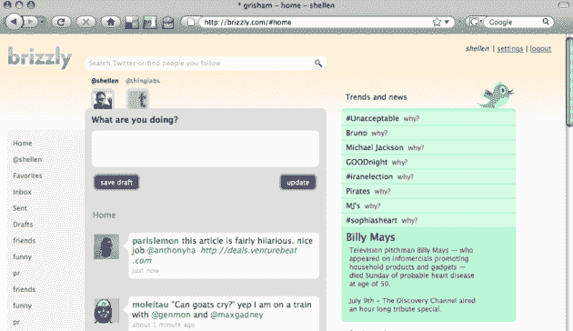

# Brizzly:一个 Twitter 阅读器，来自给你带来谷歌阅读器 TechCrunch 的人

> 原文：<https://web.archive.org/web/https://techcrunch.com/2009/07/10/brizzly-a-twitter-reader-from-the-people-who-brought-you-google-reader/>

在过去的几个月里，Twitter 在网络上的前端外观和感觉一直在慢慢改善。但它仍然远非理想，缺少用户转向其他应用程序的一些关键要素。Twitter 和它的 API 对此很满意。其中许多是专业的网络应用程序(图片和视频 Twitter 网站)或强大的桌面和移动客户端(Tweetie、Seesmic 等)。但是 [Brizzly](https://web.archive.org/web/20230125114943/http://brizzly.com/) ，一个新项目今天在我们的实时流处理上发布，想要彻底改变你在网络上体验 Twitter 的方式。

Brizzly 是 [Thing Labs](https://web.archive.org/web/20230125114943/http://www.thinglabs.com/) 下的第二个项目，这是由前谷歌 [Jason Shellen](https://web.archive.org/web/20230125114943/http://www.crunchbase.com/person/jason-shellen) 创办的[开发公司。他们的第一个项目是](https://web.archive.org/web/20230125114943/http://techcrunch.com/2009/06/11/thing-labs-we-had-plinky-now-we-have-the-brain/) [Plinky](https://web.archive.org/web/20230125114943/http://plinky.com/) ，这是一个更主动的博客项目。但是 Shellen 决定是时候推出一些东西来解决整个 Twitter 热潮，并改善它的体验。因此，他邀请了谷歌阅读器的创始人之一克里斯·韦瑟雷尔(Chris Wetherell)和该团队的其他几个人一起参与进来，共同打造了 Brizzly。

Shellen 告诉我们，它“快速、简单，并增强了阅读和创造能力”。它的一些主要特点是，它允许你从你关注的用户中创建群组，让你深入了解为什么某些话题会成为趋势，并引导信息对话。它还让你可以访问多个账户，允许你保存多份推文草稿，并跟踪你在流中停止阅读的地方。它应该像 Twitter 目前所做的那样，以更无缝的方式处理媒体(图片和视频)。

一些更强大的 Twitter 应用程序在这些功能上有所变化，但 Brizzly 是在完全基于网络的情况下这样做的。而且真的是 UI 会成就或破坏这样的东西，Brizzly 看起来有一个很好的 UI(见截图)。

此外，他们有一个杀手标志，看起来像是一只穿着死推特鸟皮的熊。

而这只是 Brizzly 的第一步。Shellen 说，他们正在考虑未来对脸书和其他一些社会服务的支持。他们计划开发一些手机专用的界面，甚至可能是一个 iPhone 应用程序。

继今天的预览，Brizzly 将在下周进入封闭测试。当他们准备好时，你可以注册接收邀请，[点击这里](https://web.archive.org/web/20230125114943/http://www.brizzly.com/)。

*注意:Brizzly 的用户界面和设计还没有最终确定，下图是工作模型的样子。*

这是来自实时流处理的 Brizzly 的视频演示:

[YouTube http://www.youtube.com/watch?v=LGxemQ3yZMY&hl=en&fs=1&]