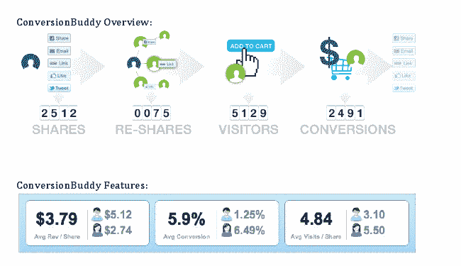

# Buddy Media 为营销人员推出智能脸书数据和分析平台 

> 原文：<https://web.archive.org/web/http://techcrunch.com/2011/09/18/buddy-media-launches-intelligent-facebook-data-and-analytics-platform-for-marketers/>

# 巴迪媒体为营销人员推出智能脸书数据和分析平台

[Buddy Media，](https://web.archive.org/web/20230205033003/https://techcrunch.com/wp-content/uploads/2010/10/facebook-marketing-social-media-marketing-power-tools-for-facebook-buddy-media.png)是一家为品牌提供脸书页面和社交媒体管理工具的公司，在新的资金支持下，该公司推出了 ConversionBuddy，这是一个面向品牌营销人员的数据和分析平台。

Buddy Media 提供了一个[一体化](https://web.archive.org/web/20230205033003/https://techcrunch.com/2009/10/20/buddy-media-launches-integrated-facebook-and-twitter-client-for-brand-management/)社交媒体管理系统，帮助创建、管理和跟踪脸书的社交活动。该平台让品牌管理机构创建、管理和跟踪多种语言[的脸书页面](https://web.archive.org/web/20230205033003/https://techcrunch.com/2010/06/21/buddy-medias-facebook-management-platform-for-brands-goes-global/)，以推动和增加用户和品牌的参与度。用户不需要有任何 FBML 知识就可以在脸书上创建页面，并且可以相当容易地创建光滑的交互式页面。

ConversionBuddy 允许品牌跟踪连接，通过了解分享、推文、转化等的数量来提高转化率。因此，品牌可以按人口统计对数据进行细分，甚至确定哪个受众群体分享社交内容最频繁，哪个受众产生的每股流量和收入最多。

新产品还将向营销人员展示哪些内容和功能最受欢迎，以及它们如何在多个社交网络中传播，哪些社交网络和电子邮件产生的每股收入最高等等。

ConversionBuddy 实际上是 Buddy Media 今年早些时候收购社交商务和分析初创公司 Spinback 的结果。该公司刚刚在 D 轮融资中筹集了 5400 万美元，由 GGV 资本牵头，机构风险投资伙伴、Bay Partners 和 Insight Venture Partners 参与。自 2010 年底以来，Buddy Media 的收入增长了一倍多，可能高达 4000 万美元。

