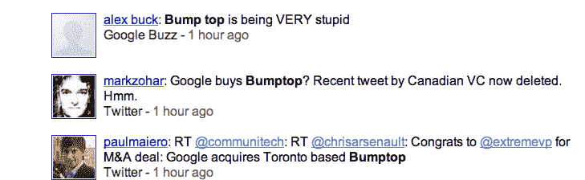

# BumpTop 正在酝酿一些事情，可能被谷歌收购(更新:已证实)

> 原文：<https://web.archive.org/web/https://techcrunch.com/2010/05/02/bumptop-possible-google-acquisition/>

# 一些事情正在 BumpTop 酝酿，可能谷歌收购(更新:证实)

**更新** : BumpTop 现在确认被谷歌收购，具体条款没有透露。该公司从加拿大天使和风投那里筹集了 165 万美元的种子资金，收购价格据传在 2500 万美元至 3500 万美元之间。

有传言称加拿大 3D 桌面界面初创公司 [BumpTop](https://web.archive.org/web/20221217001218/http://bumptop.com/) 已被谷歌收购。我们昨天开始得到提示，指向一条现已删除的来自加拿大风投的推文，称谷歌已经收购了他们。当我周五打电话给首席执行官阿南德·阿加瓦拉询问 BumpTop 是否被收购时，他回答说，“据我所知没有。”但是今天，BumpTop 的主页上有一个通知，说它将停止目前的产品，并有一个大的声明即将发布:

> 今天，我们要宣布一个重大消息:我们将把 BumpTop 带入一个激动人心的新方向，这意味着 BumpTop(Windows 和 Mac 版)将不再出售。此外，没有计划对产品进行更新。

此外，加拿大风险债务公司威灵顿金融公司的[帖子](https://web.archive.org/web/20221217001218/http://www.wellingtonfund.com/blog/2010/05/01/did-google-snatch-bumptop/)推测谷歌确实收购了他们。当我今天再次联系 Agarawala，询问谷歌是否收购了他的公司时，他的回答从之前的断然否认变成了，“抱歉，无可奉告。”肯定有事发生了。

BumpTop 有一个 3D 桌面界面，最近增加了[多点触控功能](https://web.archive.org/web/20221217001218/https://techcrunch.com/2009/09/30/bumptop-goes-multi-touch-um-awesome/)(见下面的视频演示)。只是说，它在未来的 Android 或 Chrome OS 平板电脑上看起来会很棒。我已经联系了谷歌进行确认。**更新 2** :谷歌也确认。

【YouTube = http://www . YouTube . com/watch？v=6jhoWsHwU7w&hl=en_US&fs=1&]