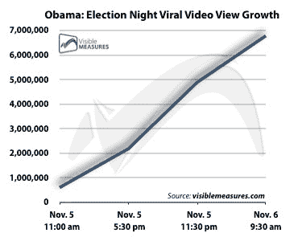

# 布什躲避鞋子的视频已经在 YouTube 上被观看了 500 多万次。

> 原文：<https://web.archive.org/web/https://techcrunch.com/2008/12/15/bush-shoe-dodging-video-already-watched-more-than-5-million-times-on-youtube/>

# 布什躲避鞋子的视频已经在 YouTube 上被观看了 500 多万次。

[http://cdn . visible measures . com/YouTube/released/YouTube loader . swf？player apid = yt player&video = OM3Z _ Kskl _ U&vmcKey = ff 80808118 f 233 c 7011d 737769845 be 6&config = auto&oid = 967 f 35913 c 07d 294 f 036852447 D4 eb3a 473 de 243:1](https://web.archive.org/web/20221209113156/http://cdn.visiblemeasures.com/youtube/released/YouTubeLoader.swf?playerapiid=ytplayer&video=OM3Z_Kskl_U&vmcKey=ff80808118f233c7011d737769845be6&config=auto&oid=967F35913C07D294F036852447D4EB3A473DE243:1)

上面的视频显示，周六在巴格达的一次新闻发布会上，一名男子向美国总统乔治·布什(George W. Bush)扔鞋，这一视频肯定会因许多原因而臭名昭著:这一行为极其无耻，美国总统周围令人难以置信地缺乏足够的安保(一名记者不得不将鞋脱下)，以及对总统在任期即将结束时在世界上的地位的可悲评论。它已经在网上声名狼藉，在 YouTube 上疯传。

根据[可视指标](https://web.archive.org/web/20221209113156/http://www.visiblemeasures.com/news-and-events/blog/bid/7686/In-Bush-vs-Flying-Shoes-Viral-Video-is-the-Winner)，YouTube 视频在至少 640 个~~网站~~不同的视频片段中被观看了超过 550 万次。左边的图表显示了周一上午 7 点到下午 5 点之间的浏览次数。

在不到 12 个小时的时间里，该视频的浏览量从 200 万增加到 550 万，在 48 小时内的病毒传播范围方面，可能会超过奥巴马的胜利演讲视频。这就是布什被人们记住的方式吗？

**2008 年 12 月 16 日**更新:周二，截至美国东部时间下午 3:30，900 个~~网站~~视频片段的浏览量跃升至 1070 万次，并累积了 83000 条评论。这比[“我裤子里的精液”更性感](https://web.archive.org/web/20221209113156/http://www.youtube.com/watch?v=4pXfHLUlZf4)

