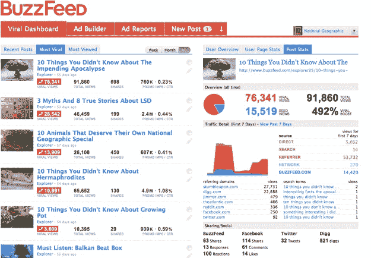

# RRE 风险投资公司、罗恩·康韦和方正集体向 BuzzFeed  投资 800 万美元

> 原文：<https://web.archive.org/web/https://techcrunch.com/2010/05/12/buzzfeed-8-million/>

# RRE 风险投资公司、罗恩·康韦和方正集体向 BuzzFeed 投资 800 万美元

让 buzz 出现在网上是一项难以捉摸的任务，但是 BuzzFeed 正在围绕它开展业务。这家纽约市的初创公司刚刚获得了由 RRE 风险投资公司牵头的 800 万美元 B 轮融资。罗恩·康韦(通过 SV 天使)和克里斯·迪克森(通过方正集体)也进行了投资。BuzzFeed 之前在 2008 年从赫斯特、软银和肯·勒勒(他们在这一轮也投入了更多资金)那里筹集了 350 万美元的首轮融资。

BuzzFeed 创始人乔纳·佩雷蒂是《赫芬顿邮报》的创始合伙人之一。肯·勒尔是两家公司的董事长，也是 BuzzFeed 的投资者。Peretti 转到了 BuzzFeed，该公司跟踪并推广网络上的病毒式视频、文章和其他内容。Peretti 也是“T3 拒绝热线”和其他网络恶作剧的幕后黑手。BuzzFeed 的业务是帮助《时代》、《赫芬顿邮报》等出版商、维亚康姆(Viacom)等品牌或广告公司传播信息。

佩雷蒂是这样解释他的业务的:“我们建立了一个病毒式分析平台，跟踪消费者如何实时与媒体互动，以及一个病毒式广告平台，为实际工作的内容发送更多流量。因此，我们使用实时数据优化病毒式传播的内容，并通过我们网站和网络上的病毒式广告赚钱。”

Peretti 计划使用新的资金扩大 BuzzFeed 的规模，并推出一种新的自助产品，允许出版商和品牌试图管理自己的病毒式 buzz 活动。到目前为止，BuzzFeed 一直在定制的基础上管理每个活动，并尝试看看哪种策略有效。它提供免费的 Buzz analytics，让网站跟踪他们自己内容的病毒式传播。在病毒式推广方面，BuzzFeed 试图尽早发现消费者开始选择和分享内容的时间，然后通过不同的渠道进行推广，包括 BuzzFeed.com 本身(在美国每月有大约 300 万独立访客)和更大的 BuzzFeed 网络，通过网站上的小工具和其他方式。Peretti 说，最终的胜利是“广告商登上 Digg、Twitter 的首页，免费获得所有这些有机流量。”

除了自助服务产品，BuzzFeed 还将采用一致的定价模式。该公司也在招聘，从一个月前的 12 名员工增加到未来几个月的 25 名。对于一个以副业开始的项目来说还不错。查看此[视频](https://web.archive.org/web/20230330002059/http://www.motherboard.tv/2010/3/31/the-king-of-internet-buzz-jonah-peretti-punk-d-nike-founded-huffpo-and-buzzfeed)了解更多关于 Peretti 的背景。

