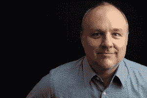

# BuzzFeed 董事长肯·勒勒支持由女儿伊莎贝尔、前沙龙 Site 凯瑞·劳勒曼领导的新动物主题网站渡渡鸟

> 原文：<https://web.archive.org/web/https://techcrunch.com/2013/07/15/buzzfeed-chairman-ken-lerer-backs-new-animal-themed-site-the-dodo-led-by-daughter-isabel-former-salon-eic-kerry-lauerman/>

《赫芬顿邮报》的联合创始人、BuzzFeed 和 Betaworks 的董事长以及 Lerer Ventures 的创始人 Ken Lerer 正在开创另一项新的媒体业务，一个名为 Dodo 的网站，将于今年秋天推出。该网站是“内容和商业”的结合，探索人类与动物的关系这一主题，由《Salon.com》的前主编凯丽·劳尔曼和莱尔的女儿[伊莎贝尔](https://web.archive.org/web/20230324083450/http://philosophy.columbia.edu/directories/student/isabel-lerer)共同运营，后者目前正在完成这一主题的博士研究。

在担任即将推出的 Dodo 的首席执行官之前，Lauerman 在互联网新闻的先驱之一 Salon.com 工作了十多年，在过去的两年半时间里，他担任主编。

虽然网站的名字可能会让你发笑，但它的内容组合不会总是像 YouTube 上的猫视频和可爱小狗列表那样轻松和蓬松，这可能有助于它获得点击量并通过社交渠道传播。娱乐将是该网站使命的一部分，但其更大的关注点从名字中可以看出:*渡渡鸟——*这种鸟的灭绝帮助世界认识到人类可以如何影响我们的生态系统，有时会带来毁灭性的后果。

#### “看看《纽约时报》的头版——他们每周都会在头版刊登一篇重要的动物故事。我们计划推出一个网站，尝试拥有这个话题。”— *肯·勒勒*

除了清淡的食物，渡渡鸟还将讲述与人类参与动物相关的故事，包括对近 70%的家庭的建议，包括宠物，健康和可持续饮食的提示，濒危物种的新闻，以及关于动物权利和剥削的故事，例如在小狗工厂和马戏团发现的故事。

根据勒尔的说法，他的公司正在支持新媒体创业并为其提供办公场所，今天有一个巨大的运动朝着这个主题发展。“我们的想法是，动物、动物权利以及动物与人之间的关系是一个即将爆发的话题，”他说。“看看《纽约时报》的头版——他们每周都会在头版刊登一篇重要的动物故事。我们计划推出一个网站，尝试拥有这个话题。”

尽管渡渡鸟并没有受到巨大病毒 BuzzFeed 的任何“启发”,但 Lerer 承认 BuzzFeed 证明了人们对网上动物的痴迷。此外，他认为 BuzzFeed 使用的模式——将更轻松的内容结合起来，为更深入的报道提供资金——对像 Dodo 这样的网站来说是有意义的，Dodo 也计划在更轻松、更快速的内容和更深入的故事之间实现 75/25 的分成。

“当我 7 年前创办《赫芬顿邮报》时，这确实是一种模式，当然也是 BuzzFeed 的模式，”勒尔说。“我相信在一定的参数范围内，这是必要的模型。我认为一个网站应该同时具备信息丰富、引人入胜、娱乐性和趣味性。”他说，一些网站没有突破一定的上限是因为它们太重了，对普通大众没有吸引力。“我希望我们做的内容网站有更广泛的吸引力，”他补充道。

还有什么比动物更广泛的呢？毕竟，所有的网络都充斥着它们——从 BuzzFeed 这样的网站，到 CuteOverload，I Can Haz Cheezeburger，等等。但随着后者在裁员名单中，一个问题是纯粹的娱乐驱动是否能带来持续的成功。

今天，我们对动物这个主题的痴迷经常通过可点击、可分享的“*awww”-*之类的帖子表现出来，但渡渡鸟的创作者认为，这只是这个领域潜力的皮毛。这是人类渴望理解和思考我们与动物，乃至整个世界的关系的一种表现。

勒勒的女儿伊莎贝尔(Isabel)对所有动物事物更深的兴趣也是她的激情所在。她的父亲说，尽管她从未成为“技术人员”，但在获得博士学位后，她将在大约九个月后加入渡渡鸟的创始团队。当然，这种投资、工作和家庭的结合是勒勒夫妇已经熟悉的——肯的儿子本的创业惊悚片《T2》也是由勒勒风险投资公司支持的。

目前，Dodo 仍然是一个非常早期的项目——这家初创公司要到今年晚些时候才会筹集种子资金。劳曼之外还没有编辑团队。也没有 logo，登陆页，固化的设计。甚至渡渡鸟商业模式的“商业”方面也仍在研究中。但是该网站的支持者今天可以说的是，除了广告，渡渡鸟还将展示带有渡渡鸟“认可标志”的产品，这将允许不同的收入流，这是令人兴奋的，Lauerman 说。(值得注意的是，尽管报道质量很高，沙龙[作为一家企业](https://web.archive.org/web/20230324083450/http://www.politico.com/blogs/media/2013/06/eic-kerry-lauerman-to-exit-saloncom-165473.html)一直在苦苦挣扎。)

除了凯丽和伊莎贝尔，渡渡鸟的另一个确定的团队成员是设计师伊夫·温伯格，她曾在另一家 Lerer 投资公司 NowThisNews 担任艺术指导。将担任首席执行官的 Lauerman 说，Weinberg 不局限于网站的任何形式或原型，其技术基础包括[内容管理系统](https://web.archive.org/web/20230324083450/https://techcrunch.com/2013/01/24/rebelmouse-hires-former-cnnmoney-and-vaynermedia-talent-to-build-out-its-content-and-partnerships/)和(是的，另一项 Lerer 投资) [RebelMouse](https://web.archive.org/web/20230324083450/http://www.rebelmouse.com/) 。

#### “我们被迷住了，被迫关心我们生活中的动物和外面的动物——在某些情况下，因为我们而岌岌可危。”— *凯丽·劳勒曼*

对于 Lauerman 来说，在沙龙工作了这么多年后加入 Dodo 是出于对这个领域的个人兴趣。尽管一些主题可能会有稍微自由一点的倾向，但他坚持认为该网站不会有政治使命。“作为一种文化，我们越来越关注这些问题，所以我认为这是捕捉已经发生的运动，而不是推动某种议程，”他解释说。

凯瑞·劳尔曼

“我们对动物的兴趣要深得多。我们着迷于、被迫去关心我们生活中的动物和外面的动物——在某些情况下，因为我们而岌岌可危地生存着，”Lauerman 补充道。

Lerer 和 Lauerman 不仅仅是对这样一个网站的商业潜力感兴趣，或者是对这个主题的一般兴趣。他们自己的生活也受到他们对人与动物关系这一主题的想法的影响。两人都称自己是“主要”素食者，尽管两人都没有做出激进的承诺。勒勒开玩笑说，“当人们不看的时候，我可能会偷偷吃一个熏牛肉三明治，”劳曼承认他永远无法完全摆脱他受中西部影响的饮食。

但他们在这里的做法是深思熟虑的，但在这个问题上并不激进，这很好地说明了渡渡鸟可以成为一个娱乐、学习甚至购物的地方，没有可能疏远读者的两极分化的议程。

*【图片】这里的和这里的*