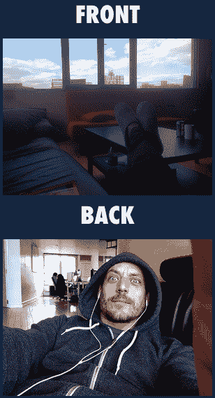

# 时髦的照片应用 Frontback 回避 Twitter 的兴趣，而是筹集了数百万美元 

> 原文：<https://web.archive.org/web/https://techcrunch.com/2013/10/29/buzzy-photo-app-frontback-shuns-twitter-interest-raises-millions-instead/>

让用户使用 iPhone 手机上的前置和后置摄像头创建合成图像的照片应用程序 Frontback 正在蓬勃发展。今年 8 月才推出，现在几乎零营销预算就获得了约 30 万次下载——但是来自[阿什顿·库彻](https://web.archive.org/web/20230128194559/http://frontback.me/p/EOQPKOmK)、[杰克·多西](https://web.archive.org/web/20230128194559/https://twitter.com/jack/status/374152733043216384/photo/1)和……等等……比利时首相[在推特和其他地方发布他们的评论。这给了它一些其他的动力:Frontback 已经完成了新一轮约 300 万美元的融资，我们还了解到，在那轮融资结束之前，Twitter 曾接洽 Frontback 收购它。](https://web.archive.org/web/20230128194559/https://twitter.com/eliodirupo/status/375910102077022208/photo/1)

Frontback 的联合创始人 Frederic della Faille 不会确认资金数额(消息人士告诉我们 300 万美元)，但他告诉我们，它来自现有的投资者 Lerer Ventures、Index Ventures 和 SV Angel 以及包括 CrunchFund 的迈克尔·阿灵顿(也是 TechCrunch 的创始人和前主编)在内的新天使；燃料资本的克里斯·霍华德；迈克尔·伯奇；查理·契弗；以及 [Initialized Capital 的](https://web.archive.org/web/20230128194559/https://techcrunch.com/2013/08/01/initialized-capital-39m/) Harj Taggar，Garry Tan 和 Alexis Ohanian。这发生在 2012 年 6 月 91 万美元的种子期之后，当时 della Faille 仍主要致力于他之前的社交出版事业。

Della Faille 拒绝在 Twitter 上发表评论。

“对此没什么好说的，”他说。“我们完全致力于与一流的团队一起打造出色的产品。”

该产品在过去几天有了一个更新，表明 Frontback 正在准备扩大规模。用户现在可以连接他们的地址簿来找到更多的朋友，除了现有的分享到脸书和推特的能力外，他们现在还可以分享正面照片到 Tumblr，电子邮件和短信。

iPhone 应用程序在功能方面也在扩展。它包括一个个性化的订阅源，里面有来自朋友们的最新帖子(下面有员工推荐)；在订阅源中发布标题；还有一个非常酷的功能，让你能够翻转顶部和底部的图像，并选择相机是拍摄面向前还是面向自己的图像。(是的，没错，如果你愿意，你现在可以自拍两张。)还有一个新的离线功能，这意味着用户可以恢复他们可能没有发送的帖子。

所有这些都将意味着更多的用户玩 Frontback，更多的时间在应用上，更多的图片。

### 从背包的后面到前面

Frontback 的崛起令人瞩目，它是一个很好的例子，说明当创始人决定追求最初看起来无关紧要或次要的途径时，初创公司的命运会如何迅速改变。Checkthis 是一个轻型发布平台，允许用户创建带有照片的一次性博客帖子并与其他人分享，它最初成立于比利时，并在 91 万美元的种子轮融资后搬到了纽约，以推动其发展。

目前还不清楚这种增长是否没有它想要的那么快——顺便说一下，Checkthis 仍然存在——或者它的创始人只是对如何使用它的一个特定应用程序非常感兴趣:第一个 Frontback 来自于 2013 年 3 月 della Faille 的一个[check this](https://web.archive.org/web/20230128194559/http://checkthis.com/s374)帖子，该帖子解释了该应用程序的基本概念，其中有一张他自己在威廉斯堡生活/工作空间的照片。

> “一个#前后贴的想法是一种超级简单有趣的分享瞬间的方式。你停下一切，正面照一张，背面照一张，然后点击分享——笑话是被授权的。
> 
> 如果你足够疯狂，你甚至可以写下这样的描述:“这就是现在的我，在我们威廉斯堡公寓的沙发上与你互动。在我身后，你可以看到(或试图看到)来自 Poutsch 的 Etienne 正在他的办公桌前工作。"

快进到一个独立的 Frontback 应用程序发布的四个月，事实证明它是在该公司只有几周时间靠其资金生活的时候出现的。但这款应用挺过来了，头几周就有 20 万次下载；这很快导致了他们搬到旧金山(新的生活/工作住所就在本周)，一些人开始问“[front back 是下一个 Instagram 吗？](https://web.archive.org/web/20230128194559/http://www.bloomberg.com/video/is-frontback-the-next-instagram-r77e_FK9SBOzfPlf3dApuQ.html)

据我和其他人所见，旧金山 Disrupt 的 Frontback 发生了真正的变化——也是在这里，德拉·费尔勒(della Faille)披露了 20 万次下载数据和这家初创公司的濒死体验。在那里，舞台后面，黛拉·菲尔勒躲在一个房间里——我想是迈克·阿灵顿的绿色房间——风投们一个接一个地鱼贯而入与他会面。“这很明显。他在主持法庭，”一个人告诉我。

有趣的是，Twitter 在这个过程中采用了 Frontback。它说明了这家公司在走向 IPO 的过程中，如何热衷于在其平台上增加更多的参与，一直在开发和收购与 Twitter 以其快速参与而闻名的服务——T2 Vine T3 是这一战略的一个重要例子。它还指出[报道](https://web.archive.org/web/20230128194559/http://allthingsd.com/20131017/twitter-plans-to-revamp-its-private-messaging-product/)我们已经看到 Twitter 正在寻求重新审视其信息产品组合。从本质上来说，Frontback 既是一种分享图片的媒介，也提供了一种通过短信直接发送给特定用户的方式，当然未来还会增加更多的直接信息渠道。

同样有趣的是，黛拉·菲尔勒公司并没有在他们的祖国比利时孵化和尝试生长前锋。尽管我们已经看到围绕科技主题的所有进展正变得越来越分散到硅谷之外(本周柏林的混乱就是一个证明)，但德拉·法伊勒认为，在旧世界冒险本质上更具挑战性。

“在欧洲，你不能太雄心勃勃，”他说，“因为人们不会把你当回事。”他还认为，欧洲的风气通常是不要过于关注小细节。“我们花在 Frontback 相机上的时间，我很确定欧洲的投资者不会接受这种程度的细节。他们会说，‘它起作用了。“打开照片应用，然后启动它，”"

最终会有适用于 iPad 和 Android 的应用程序来帮助服务扩展…但还不是时候。意识到今天和明天肯定会有越来越多的相机应用，Frontback 的目标是让自己成为更多人使用的应用，因为它是最好的。“现在的重点是设计。我们对此非常重视，”他说。