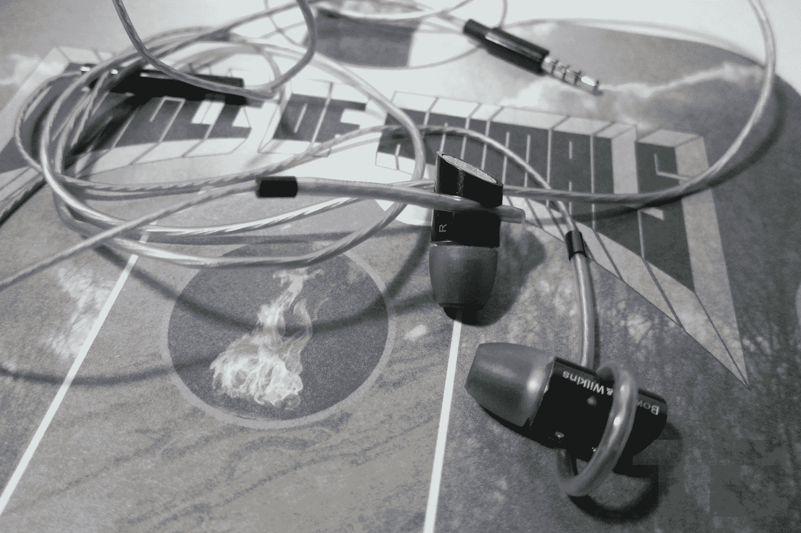

# B&W C5 评论:听起来很棒，看起来很优雅，像公牛一样强壮

> 原文：<https://web.archive.org/web/http://techcrunch.com/2011/09/16/bw-c5-review-sound-great-look-classy-and-strong-like-bull/>

令人惊讶的是，在 2011 年，大约在耳塞诞生 1000 年后，一个创新的模型出现了。但是 Bowers & Wilkins 确实做到了。C5 入耳式耳机[几周前首次亮相](https://web.archive.org/web/20230205021927/https://techcrunch.com/2011/07/11/the-bowers-wilkins-c5-in-ear-headphones-will-hold-your-ears-in-sweet-harmony/)，我已经测试了一副耳机有一段时间了。简而言之:我恋爱了。哦，不仅仅是它们听起来很棒；它们是由 B & W 制造的，所以我想也不会少。是他们的设计让我会心一笑。

Bowers & Wilkins 长期以来一直在生产世界上最好的扬声器。几年前，他们带着齐柏林飞艇潜入了 iPod 音乐基座的世界，不久之后，又推出了齐柏林迷你飞艇。这一举动吓坏了音响发烧友势利世界中的一些人，但 B&W 做得很好，用他们的普通消费者线保持了他们的商标高端感觉。进入 C5 入耳式耳机。

这些入耳式耳机并不是该公司第一次尝试耳机，因为他们也销售挂耳式 P5。这些复古罐售价 299 美元，在嘻哈代言耳机占主导地位的价格点上保持不变。

C5 入耳式耳机大同小异。它们价值 179 美元，可以轻松媲美售价超过 200 美元的耳机。它们听起来不如 P5s 好，但感觉很棒，而且比耳挂式耳机多功能得多。

大多数入耳式耳机要么只是放在你的耳道内，要么有一种钩子缠绕在你的耳朵上，但 C5s 没有。耳机线通过耳塞本身延伸到耳朵外软骨的内脊，提供了一个安全和令人惊讶的舒适的握持。这只会产生最轻微的压力，但它是在你耳朵的外部，而不是在耳道内部。钨耳塞本身更偏向于耳尖，这有助于进一步固定它们。

这些东西是敲不掉的。它们可能会在地震中经受住弹簧单高跷的弹跳——我并没有这样测试过。尽管如此，在一项快速测试中，他们仍然原地不动，测试内容包括跳跃、原地跑步，以及最终的大量深呼吸。与其他所谓的运动耳塞不同，C5 看起来不像是 2050 年耐克设计的实验品，它们甚至可以与眼镜配合使用。

 
B & W 显然为数字媒体设计了这些耳机:有一个内嵌控制器，电缆适当地短。我不能只用 Pandora 测试一个 B & W 产品——这些是 Bee 和 Dubyas，伙计——所以我拿出了 ol' Pioneer 转盘和披头士的经典*白色专辑*。使用昂贵得多的 Beats Pro 耳挂罐作为参考，B & W C5s 凭借坚实的中音响应和完整的声音保持了自己的优势。清晰度令人惊讶，低端足够但不压倒——至少与披头士。

‘动物圈’*[灭光](https://web.archive.org/web/20230205021927/http://www.rdio.com/#/artist/Circle_of_Animals/)* 黑胶原来是 C5s 吃不消。小耳塞根本无法再现持续的低通音调或极其紧密的电子静电，导致声音比我习惯听到的要平坦得多。

在更多的黑胶唱片之后，很明显 C5s 不是为音响发烧友设计的——不是说我会自称是一个——所以我转向 Rdio，C5s 开始发光。B&W 设法在这些小家伙身上植入了大量的声音。一旦输入便于携带的压缩音乐，它们就会亮起来。C5s 的音质甚至比更贵的舒尔 SE315 入耳式耳机还要好。即使低音响应没有那么有力，声音也更加饱满，而高音更加尖锐。此外，C5 更加舒适。

C5s 是适用于数字媒体的出色中音耳机。我希望他们有主动降噪功能，因为软尖只能消除一些环境噪音。尽管如此，179 美元，你将很难找到一个更好的声音或合适的耳机。**买这些**。

[产品页面](https://web.archive.org/web/20230205021927/http://www.bowers-wilkins.com/Headphones/Headphones/C5/overview.html)