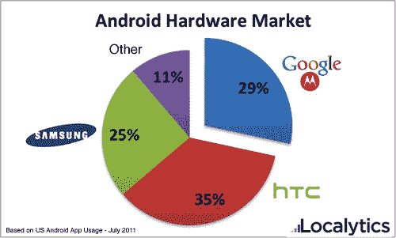

# 通过收购摩托罗拉，谷歌现在可以在 Android  上为所欲为了

> 原文：<https://web.archive.org/web/http://techcrunch.com/2011/08/15/by-buying-motorola-google-can-now-do-whatever-the-heck-they-want-with-android/>

# 通过收购摩托罗拉，谷歌现在可以在安卓上为所欲为了

随着今天早上宣布他们计划以 125 亿美元收购摩托罗拉移动公司，谷歌正在收购 T2 的很多东西。他们购买了 20，000 名员工(几乎是员工总数的两倍。)他们正在购买一个超过 24000 项专利的荒谬而令人生畏的军械库(我的意思是，得了吧:摩托罗拉在 [*手机*](https://web.archive.org/web/20230304094022/http://patft.uspto.gov/netacgi/nph-Parser?Sect1=PTO1&Sect2=HITOFF&d=PALL&p=1&u=%2Fnetahtml%2FPTO%2Fsrchnum.htm&r=1&f=G&l=50&s1=3906166.PN.&OS=PN/3906166&RS=PN/3906166) 上拥有专利)。)但谷歌还买了一样东西，它让安卓游戏升级了:安卓在美国现有市场份额的近 30%。

多年来，谷歌几乎没有自己软件平台的硬件市场份额(甚至所谓的“谷歌手机”Nexus 设备都是由 HTC 和三星制造的)，谷歌刚刚成为 Android 的第二大制造商。

谷歌罗拉以 29%的比例位居第二，仅次于 HTC (35%)，领先于三星(25%)。这一数据来自移动分析公司 Localytics 今天早上发布的最新数据。

**这可能意味着的一些事情:**

*   **为大家更新！**现在在谷歌的保护伞下，摩托罗拉保持其 Android 手机更新的压力将比以往任何时候都大……这反过来又增加了其他所有人的压力。如果摩托罗拉保持他们的份额，谷歌给他们点着一把火(这是他们应该做的)，近 *30%* 的下架设备将会迅速升级到每一个新的软件版本。其他制造商将感受到支持尽快升级的压力，否则就会被认为是*没有*的制造商。
*   **The death of the skin?** So far, any of the devices that Google has had a direct role in launching run what they call a “pure Google Experience” — that is, it’s Android, straight-up, without any of the custom interface replacements/overhauls that the manufacturers insist on strapping to their own Android devices. HTC has Sense. Sony Ericsson has UXP. Samsung has TouchWiz. Motorola *had* Motoblur.

    摩托罗拉最近宣布他们将逐渐停止 Motoblur 的开发，现在我们知道为什么了。谷歌不希望他们自己的手机制造商升级安卓系统——这意味着安卓系统出了问题。虽然 Moto 可能还会有一两款搭载 BLUR 的设备，但预计他们所有的新设备迟早都会运行普通 Android。

    看看这如何影响其他制造商的皮肤工作将会很有趣。他们会退回到普通的安卓系统，因为这是大多数用户所期待的，还是会加强他们的用户界面调整工作，以区分他们的产品？

*   **谷歌可以通过欺凌标准硬件规格来解决 Android 的“碎片化”问题**尽管这些标准往往被夸大了，但 Android *确实存在碎片化问题*。从开发/测试的角度来看，最烦人的是不同制造商使用的屏幕分辨率的巨大差异。对于 Googorola 来说，说“嘿，伙计们，在接下来的一年左右的时间里，我们只打算在我们自己的设备上使用 800×480 显示器”有多容易？你没有必要去，但是，你知道，你可能应该去。”？

谷歌刚刚在一场他们长期假装不感兴趣的比赛中从零到 60(嗯，从零到 30%——但你明白我的意思)。他们站在一边，让主要制造商将 Android 提升到顶端——现在它已经在那里了，他们正在猛扑过去，并对硬件方面的事情进行指挥控制。是邪恶的吗？也许有一点。但也是彻头彻尾的*天才*。Marketshare 坚持认为，谷歌将对口袋中 30%的硬件的去向拥有最终决定权，并能够相应地影响其他制造商。

指望安卓除了改进什么都不干，*快*。