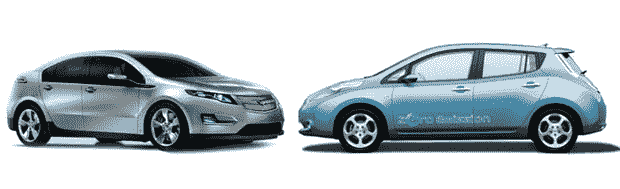

# 根据数据:雪佛兰 Volt vs 日产 Leaf TechCrunch

> 原文：<https://web.archive.org/web/http://techcrunch.com/2010/07/27/by-the-numbers-chevy-volt-vs-nissan-leaf/>

# 从数据上看:雪佛兰伏特 vs 日产聆风

很难忽视[雪佛兰 Volt](https://web.archive.org/web/20230203094226/http://www.crunchgear.com/tag/chevy-volt/) 和[日产 Leaf](https://web.archive.org/web/20230203094226/http://www.crunchgear.com/tag/nissan-leaf/) 之间迫在眉睫的电动汽车摊牌，尽管这两款车的性质和目标市场完全不同。虽然日产 Leaf 只是一款包装精美的电动汽车，续航里程约为 100 英里，但雪佛兰 Volt 采取了不同的方式，续航里程有些有限，只有 40 英里，但只要油箱里有油，车载燃气发电机就会为电动机提供动力。通用汽车的目标显然是以 41，000 美元的建议零售价定位高端市场，而日产 Leaf 则以 32，000 美元的起价定位低端市场。

那很好。世界上有足够的空间容纳两辆车。这里不一定要有赢家。就销售数字而言，无论如何，日产 Leaf 最初将比 Volt(或其对应的[欧宝 Ampera](https://web.archive.org/web/20230203094226/http://www.crunchgear.com/2009/02/20/opel-ampera-completely-revealed-early/) )进入更多的市场。通用汽车预计第一年仅销售约 1 万辆 Volts，而日产已经有 1.7 万辆 Leaf 的预购订单，比第一年的估计高出 5000 辆。显然，这两款车都备受期待，所以从现在开始，无疑会围绕工作场所的饮水机进行比较。这是我们目前所知的。

通用汽车和日产汽车都战略性地推出了各自汽车的细节。两者的性能数据仍未公布。Volt 的油箱大小未知，日产也没有公布保修信息。很明显我们还没有所有的信息，但是有足够的火力和你的同事打一场小火拼。