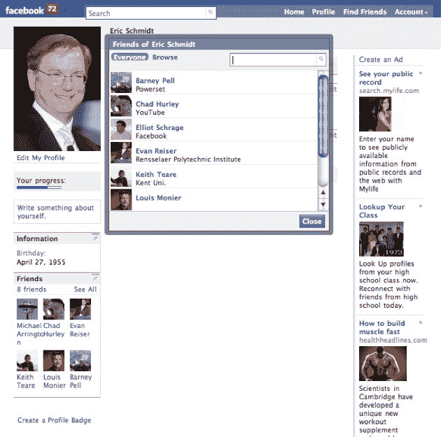

# 加州一项将在线模仿定为犯罪的法案从今天开始生效 

> 原文：<https://web.archive.org/web/https://techcrunch.com/2011/01/01/california-bill-criminalizing-online-impersonations-in-effect-starting-today/>

加利福尼亚州的 SB 1411 法案，对某些在线模仿增加了一层刑事和民事处罚，从今天开始生效。后果包括高达 1000 美元的罚款和/或高达一年的监禁。所以不要去做一些疯狂的事情，比如在脸书冒充谷歌首席执行官埃里克·施米特。可能会有后果。

[法案](https://web.archive.org/web/20230216164217/http://leginfo.ca.gov/pub/09-10/bill/sen/sb_1401-1450/sb_1411_bill_20100927_chaptered.html)的全文和摘要如下。在 [ZDNet](https://web.archive.org/web/20230216164217/http://www.zdnet.com/blog/perlow/analysis-californias-online-impersonation-law-effective-january-1/15322?tag=mantle_skin;content) 上也有很好的概述和分析。国家设立了一项新的罪行，并在《刑法典》中增加了一个新的章节。

必须有伤害、恐吓、威胁或欺诈他人的意图——不一定是你所冒充的人。包括讽刺和恶搞在内的言论自由问题并没有在法案文本中得到解决。法院可能会解决这个问题。希望没有我的直接参与。

> SB 1411，思密达。冒名顶替:互联网。根据规定，现有法律将假冒他人私人或官方身份的行为定为犯罪。
> 现有法律还将故意访问和未经
> 许可更改、损坏、删除、破坏或以其他方式使用任何
> 数据、计算机、计算机系统或计算机网络，以便
> 设计或执行任何欺诈、欺骗或
> 勒索或非法控制或获取金钱、财产或数据的计划或手段的行为定为犯罪。对于违反该法的行为，除了规定的刑事处罚外，现有法律授权受害方根据规定对违反者提起民事诉讼。
> 该法案规定，任何人在知情且未经
> 同意的情况下，通过
> 互联网网站或通过其他电子手段可信地模仿另一个真实的人，以达到伤害、恐吓、威胁或欺骗另一个
> 人的
> 目的，则犯有轻罪。该法案除了规定的刑事处罚外，还授权遭受损害或损失的人对违反该规定的任何人提起民事诉讼。因为该法案将创造一种新的犯罪，该法案将实施一个州强制的地方项目。加州宪法要求州政府向当地机构和学区报销
> 州政府规定的某些费用。法定条款规定了进行报销的程序。本法案将规定，出于特定原因，本法案不要求报销。
> 
> 加利福尼亚州人民颁布如下法令:
> 
> 第一节。《刑法》增加了第 528.5 条，内容如下:
> 528.5。(a)尽管有任何其他法律规定，任何人
> 在知情且未经同意的情况下，通过互联网网站或通过其他
> 电子手段可信地模仿另一个
> 实际存在的人，目的是伤害、恐吓、威胁、
> 或欺骗另一个人，则根据(d)小节，该人犯有可受处罚的
> 公共罪行。
> (b)就本节而言，如果
> 另一人合理地相信或确实合理地相信
> 被告曾经或现在是被冒充的人，则冒充是可信的。
> (c)就本节而言，“电子手段”应包括
> 以他人名义在社交
> 互联网站上开立电子邮件账户或账户或个人资料。
> (d)违反(A)小节的行为可处以不超过
> 一千美元(1000 美元)的罚款，或不超过
> 一年的县监狱监禁，或同时处以罚款和
> 监禁。
> (e)除了任何其他可用的民事救济之外，因违反(a)款
> 而遭受损害或损失的人可以根据第 502 节(e)款和
> (g)款
> 第(1)、(2)、(4)和(5)款，对违反者提起民事诉讼，要求赔偿
> 损害和禁令救济或其他衡平法救济。(f)本节不排除根据任何其他法律进行起诉。
> 秒。2.根据加州宪法第 XIII B 条第 6 节第
> 款，本法案不要求报销，因为
> 当地机构或学校
> 区可能产生的唯一费用是因为本法案产生了新的犯罪或
> 违法行为，消除了犯罪或违法行为，或在
> 政府法典第 17556 节的含义内改变了犯罪或违法行为的处罚
> ，或在第 XIII B 条第 6 节的
> 含义内改变了犯罪的定义