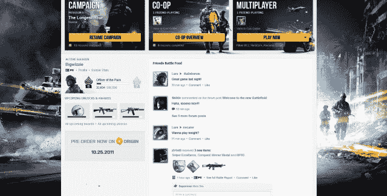

# 使命召唤每年 50 美元的订阅服务预示着游戏昂贵的未来 

> 原文：<https://web.archive.org/web/http://techcrunch.com/2011/09/02/call-of-dutys-50-per-year-subscription-service-heralds-an-expensive-future-for-gaming/>

世界上最大的游戏特许经营已经成为他们自己的生意。魔兽世界支撑着一个巨大的黄金农业和灰色市场的光环产业。 *Farmville* 及其同类公司已经将微交易变成了数百万笔。开发像*刺客信条*或*战争机器*这样的个人游戏的团队比许多完整的公司还要大。所以赌注越来越高也就不足为奇了。

使命召唤*是世界上最受欢迎的游戏之一，虽然以 40-60 美元的价格销售数百万份游戏是一个真正的收入来源，但动视希望他们新的使命召唤精英服务将带来经常性收入，并聚集粉丝群。但是粉丝们会接受游戏本身每年 50 美元费用吗？*

部分精英服务将免费提供，如移动应用程序、统计数据共享和分析以及官方部落创建。但是[精英的付费部分刚刚被详细说明](https://web.archive.org/web/20230204232832/http://www.1up.com/news/call-of-duty-elite-costs-49-per-year)，它对新游戏秩序的暗示同样令人兴奋和沮丧。

主要的吸引将会是新的内容，以地图、模式和大概的武器和角色装饰的形式。还会有每日裁判锦标赛，奖品像 iPads。Activision 描述了一个“为期九个月的 DLC 赛季”,有大约 20 条内容——以任何标准来看都很多，甚至可能超过了 CoD 的粉丝们愿意接受的程度。许多开发商已经被指控在发布时销售一半的游戏，并在接下来的一年左右分发剩余的游戏，尽管盒装游戏可能对许多人来说已经足够了，但对售后购买的强调令人不安。

到目前为止，一切都在意料之中，但更大的影响更有趣。Valve 谈到了“游戏即服务”，但他们对 DLC 的想法比动视稍微不那么赚钱。团队堡垒 2 社区和他们开发的几十个插件并不是每个人都可以效仿的榜样，但你不太可能在世界上找到一个更令人满意的游戏社区。动视的这一想法实际上把 CoD 放在了第二人生或虚拟现实游戏的领域中。人们已经非常认真地对待他们在网络游戏中的“职业”，但是我们正在看到的[社交整合](https://web.archive.org/web/20230204232832/http://www.battlefield3online.com/battlefield-3-general-discussion/653-battlefield-3-battlelog.html)(就像上面的*战地 3 的*战斗日志)，与其他平台的整合程度提高，以及所涉及的巨额资金增加，使得这款下一代“大型”游戏成为非常严肃的业务。

这有点像当年电视增加了 Showtime 和 HBO 等付费频道。你不得不致力于它，并且创建的社区与围绕网络的更平凡的社区平行，但是更加专注。但表演时间只能有这么多，尤其是如果交易的货币是时间的话。有钱的人可以购买所有的付费频道，但随着*使命召唤、魔兽世界、光环*等都扩展成为整个世界，一个游戏玩家只能做这么多。这种趋势将会继续，因为这里面有很多钱。

我们会不会不再看到售价 50 美元就完事的“传统”游戏？当像 Valve 和 Activision 这样的公司有能力为金钱提供更多的东西时，就必须做出一些牺牲(尽管他们以后可能会从你身上榨取更多)。XBLA 和 PSN 廉价可下载游戏的兴起似乎提供了一条中间道路。我期待更多价格在 5 美元到 20 美元之间的游戏，像 *Braid* 和 *Bastion* 这样的热门游戏，它们不试图建立一个平台，只是讲述一个故事，找点乐子。与此同时，你将为大狗特许经营权的优质体验支付越来越多的费用。

是面向游戏玩家的 pro 吗？一旦定价和排他性问题解决了，我想是的。人们真的很喜欢这些深度游戏体验，虽然我不像他们一样需要宣传我的成就，但我肯定能看到其中的吸引力。显然动视也是如此，他们也看到了机会。希望过渡不会太艰难。伴随着墨盒和游戏机长大的一代人可能不得不让步。这迟早会发生的。