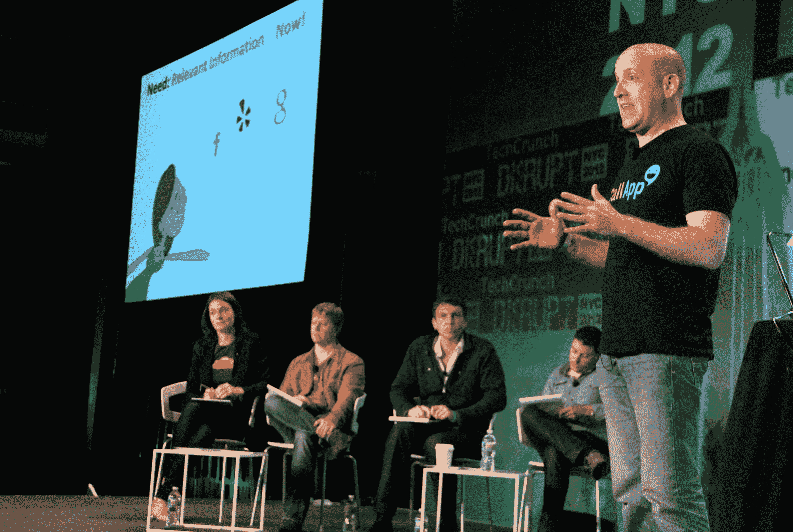

# CallApp 利用社交数据构建更智能的智能手机通讯录

> 原文：<https://web.archive.org/web/https://techcrunch.com/2012/05/21/callapp-disrupt-launch/>

一天中我最不喜欢的时刻之一是当我的 iPhone 响起，而号码不在我的通讯录中。是创业者的重要电话吗？一个随机的公关人员向我推销？还是只是个电话推销员？等我接了才知道。

今天在 Disrupt 网站上发布的初创公司 CallApp 希望首先消除那些尴尬的时刻。它正在创建首席执行官兼联合创始人奥德·沃洛维兹所说的“通用社交联络簿”它从社交网络和其他数据源提取数据，为用户提供更多关于电话和其他通信的背景信息。这些数据也来自 CallApp 用户——用户可以编辑 CallApp 列表，如果他们愿意，可以将他们的通讯录添加到公司的通用数据库中。

因此，当你接到电话时，即使电话是来自你的联系人名单之外的人，你也应该能够看到他们的信息——比如一张照片、他们在脸书的最新动态，以及你最近与他们通信的电子邮件往来。

当然，如果你的电话已经在响了，在你需要接电话之前你只有几秒钟的时间，但至少你可以瞥一眼你的屏幕，然后带着一些基本的背景进入通话。当你要打电话时，CallApp 应该会更有用。然后，社交网络更新可以给你一个开始谈话的方式，或者告诉你某人何时出国旅行，所以现在可能不是联系他们的最佳时机。您还可以将个人提醒附加到 CallApp 联系人，与他们共享您的位置，或安排会议。

在某些方面，这个概念非常类似于电子邮件插件，如 Rapportive ( [最近被 LinkedIn](https://web.archive.org/web/20230402003450/https://techcrunch.com/2012/02/22/rapportive-linkedin-acquisition/) 收购)或 Xobni。然而，沃洛维兹表示，将这些信息引入智能手机会使其处于不同的环境中。毕竟，当他接到电话时，“我迫不及待地想上网看看是谁打电话给我。这是为您提供实时、即时、最相关的信息，以及执行这些信息的工具。”

沃洛维兹还说，尽管名为 CallApp，但它不仅仅是用来打电话的——他估计自己 50%的时间只用来打电话。该应用程序还列出并连接到其他联系方式，如 WhatsApp Messenger 和 Viber。沃洛维兹说，这种体验的核心不是打电话，而是联系本身。

CallApp 也不限于个人联系人列表。它也包括商业，向你展示 Yelp 评论、谷歌街景或你正在考虑预订的餐馆菜单。

展望未来，沃洛维兹表示，公司将增加更多鼓励“意外收获”的功能。

这款应用可以在安卓手机上使用(你可以[在](https://web.archive.org/web/20230402003450/https://play.google.com/store/apps/details?id=com.callapp.client&hl=en)从 Google Play 下载)。CallApp 也在为 iPhones 开发一个版本，尽管 Volovitz 估计，由于“一些技术问题”，它将拥有 Android 版本 80%的功能。

沃洛维兹表示，该公司还没有将这款应用(免费)货币化，但有一些可能的商业模式，包括会员费。该公司已经从未披露的风险投资公司和天使投资者那里筹集了 100 万美元的资金。

### 扰乱问答

**问**:iOS 的 app 有什么不同？

答:比 Android 有更多的限制，比如你必须使用内置的拨号器，而不是你想要的任何拨号器。

**问**:有哪些病毒挂钩？

**答:**如果你使用 CallApp 与某人分享信息，他们会收到一条链接到该内容的短信，并要求他们下载该应用。

问:给我们讲讲技术。

**答:**我们做的是人工智能，大数据。该系统知道如何将正确的人与正确的号码联系起来，例如使用位置来缩小搜索范围。

**问:**为什么其他改进的联系本会失败，为什么你会成功？

**答:**关键在于执行力和雄心。如果你在客户端建立一个应用程序，你只能在手机上获得有限的联系人信息，而 CallApp 的众包，基于云的方法。