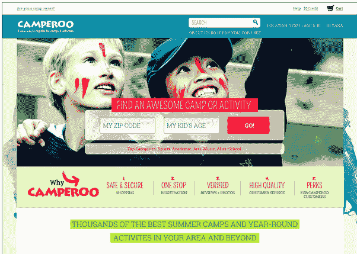
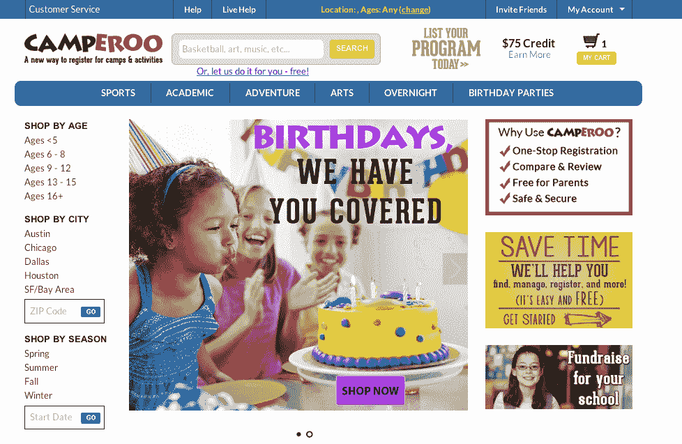

# Camperoo 帮助家长寻找和预订夏令营及其他儿童活动 

> 原文：<https://web.archive.org/web/https://techcrunch.com/2014/03/20/camperoo-helps-parents-find-and-book-summer-camps-other-activities-for-kids/>

如今，打算为孩子的课外活动做计划、寻找夏令营或日间项目的父母们面临着一项相当耗时的任务，这项任务不仅需要进行一些互联网调查，甚至还要打电话到镇上四处打听。这是因为没有集中的资源来发现这类项目。一家名为 [Camperoo](https://web.archive.org/web/20221006183304/http://www.camperoo.com/) 的初创公司希望通过将夏令营、空手道营、科技营、烹饪班等聚集在一个屋檐下来改变这种情况。

这家公司是由 Emmie Chang 于去年春天创办的，她本人虽然还没有为人父母，但在这个领域有着第一手经验，此前她曾创办并管理过一个儿童科技营。(这个项目一直持续到今天，不过张茵几年前就退出了日常工作。)

但是在经营她自己的营地时，Chang 经常会遇到 Camperoo 试图解决的问题。就是父母会问她“我怎么到现在才听说你？”

后来，在研究在线售票软件时，常意识到，父母可以更好地利用在线营地注册系统，该系统的工作方式更像现代电子商务网站，从注册到支付等与营地有关的一切都在同一个平台上进行。

今天，Camperoo 为其合作伙伴提供这种服务，这些合作伙伴包括大型和小型组织，他们举办夏令营、日间项目和其他适合孩子的活动，包括生日派对。该服务提供了用于管理预订、支付处理、电子邮件通知、登记/退房系统的工具，并可以托管通常作为纸质讲义处理的文件，如医疗释放表、登记报告和名册。此外，父母可以在网站上查看他们孩子的营地，帮助其他像他们一样的人也找到他们所在地区最好的活动。

自推出以来，该服务已发展到包含 3，450 个营地、课程和生日派对产品，相当于 23，246 个可用的会议和课程。该服务目前在 34 个州设有营地，但最高密度是在主要的大都市地区，包括旧金山、芝加哥、休斯顿、奥斯汀和达拉斯。现在，该网站上提供的大多数(80%)营地都是较小的项目和产品，尽管随着 Camperoo 开始预订更大的品牌，包括 Rock School 等组织的特许经营者，一些 YMCA 甚至博物馆，如 Camperoo 最初成立的城市休斯顿的美术博物馆，这种情况开始发生变化。

需要说明的是，该公司并不只是从其他来源收集露营清单，而是让供应商直接注册，在 Camperoo 网站上列出清单。对于营地提供商来说，Camperoo 实际上是免费使用的，但如果 Cameperoo 通过其在线注册软件代表他们销售，他们将收取 10%-20%的佣金。

现在，Chang 加入了 Y Combinator，在帕洛阿尔托经营公司，而创业团队的大部分成员仍留在休斯顿。