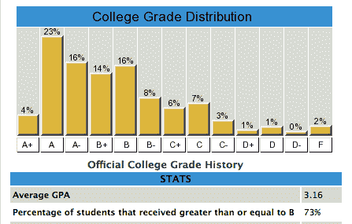

# CampusBuddy 将校园评分记录交给学生 

> 原文：<https://web.archive.org/web/https://techcrunch.com/2008/10/17/campusbuddy-hands-over-campus-grading-records-to-students/>

# CampusBuddy 将校园评分记录交给学生

对许多学生来说，大学的学术部分包括四年(或更长时间)在校园里寻找最容易的教授。大学可能是学习新事物的时候，但研究生院并不在乎你拓宽了多少视野——对他们来说，GPA 和考试成绩才是最重要的。

有一些流行的网站要求学生给他们的教授打分，以帮助突出最好的(或最容易的)教授，但这些网站上的大多数评论往往是高度两极化的——学生往往要么喜欢教授，要么讨厌教授。用户提交的成绩也是如此，因为学生们更愿意分享他们不及格或得了 a 的成绩，而不是表现平平。上周发布的脸书新应用软件 CampusBuddy 希望消除这些评级中的一些偏见。该公司收集了全国 250 所学校的评分记录，让学生准确感受到教授在学期结束时有多慷慨。

CampusBuddy 数据库中的每条记录都来自全国各地的公立学校，因为这些学校在法律上有义务根据要求公布他们的成绩。类似的评级网站 Pick-A-Prof 为这种数据库铺平了道路，甚至[起诉](https://web.archive.org/web/20221005194527/http://www.dailycal.org/article/21485/uc_to_release_grading_records_to_web_site)加州大学戴维斯分校访问他们的记录。CampusBuddy 首席执行官 Mike Moradian 承认这两个网站是相似的，但他表示，Pick-A-Prof 收取 10 美元的年费，而 CampusBuddy 是免费的(该网站计划利用广告来产生收入)。他还表示，虽然任何人都可以利用这些公共信息创建自己的数据库，但这非常耗时——一些学校需要长达 8 个月的时间来满足要求。

CampusBuddy 脸书应用程序还包括一些社区功能，Moradian 说这些功能可以替代已经被淘汰的脸书网络页面。用户可以看到他们班上的其他学生，给未来和现在的学生留下关于他们学校的评论，上传和下载旧班级的文件。该应用程序还支持没有分数的学校以及高中。在接下来的几个月里，CampusBuddy 将推出一个网站来补充其脸书应用程序，尽管 Moradian 表示这将取决于脸书连接最终何时推出。

该网站将面临来自知名评级网站的激烈竞争，包括 PickAProf 和 RateMyProfessors。该网站还将与位于脸书的 [Koofers](https://web.archive.org/web/20221005194527/http://www.crunchbase.com/product/koofers) 和 [Check My Campus](https://web.archive.org/web/20221005194527/http://www.crunchbase.com/company/check-my-campus) 展开竞争，这两家公司刚刚被选为来自 [fbFund](https://web.archive.org/web/20221005194527/http://www.beta.techcrunch.com/2008/10/15/the-fbfund-gives-out-cash-to-25-facebook-developers/) 的现金资助的赢家。