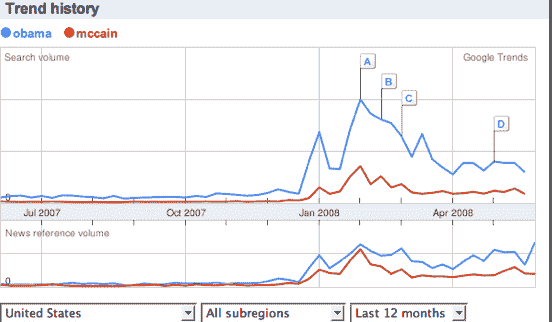
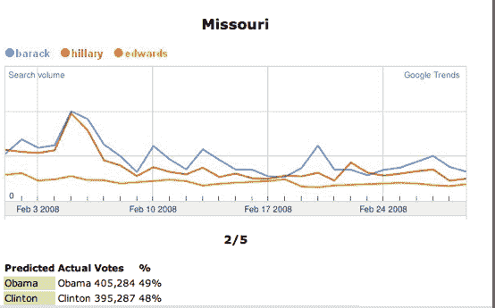
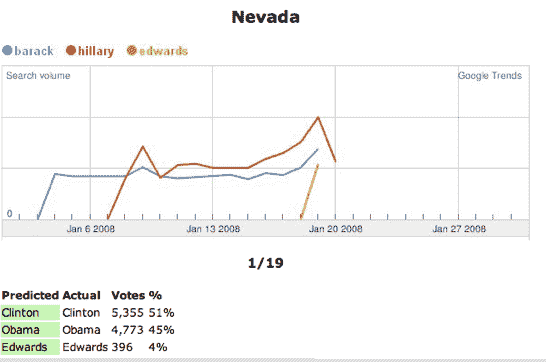

# 谷歌趋势能预测选举吗？

> 原文：<https://web.archive.org/web/https://techcrunch.com/2008/06/07/can-google-trends-predict-the-election/>

如果在谷歌上搜索“奥巴马”的人比搜索“麦凯恩”的人多，这是否意味着他更有可能赢得选举？

就此而言，并非每个美国选民都使用谷歌，甚至使用互联网。但确实有足够多的人使用谷歌，其搜索模式不能被任何候选人、媒体或任何对选举结果感兴趣的人忽视。幸运的是，谷歌让任何人都能在[谷歌趋势](https://web.archive.org/web/20230316225113/http://www.google.com/trends)上看到不同搜索词的相对受欢迎程度。上面的截图来自我刚刚做的过去 12 个月美国[“奥巴马”和](https://web.archive.org/web/20230316225113/http://www.google.com/trends?q=obama%2C+mccain&ctab=0&geo=US&geor=all&date=ytd&sort=0)“麦凯恩”的对比。如果搜索量可以预测选举结果，而且选举是在今天举行的，那么奥巴马会赢。

更多传统的民意调查得出了同样的结论。6 月 4 日和 5 日进行的一项 CNN 民意调查显示，奥巴马以 47%领先于麦凯恩的 43%(拉尔夫·纳德有 6%)。盖洛普民意测验显示竞争更加激烈，奥巴马以 46%对麦凯恩的 45%。显然，这是一场势均力敌的比赛，从现在到 11 月，情绪可能会向任何方向发展。搜索量和新闻提及量之间可能存在关联，这在上图中也进行了比较(通过从谷歌新闻中提取数据)。

不过，谷歌趋势的伟大之处在于，你可以按州进行搜索。一项关于谷歌趋势在初选中预测能力的深入分析(由弗吉尼亚州的学生 Michael Giuffrida 完成)显示~~在~~至少~~一半的情况下~~对于民主党初选，谷歌趋势在预测结果方面做得很好。更新:澄清一下，这项分析同时考虑了民主党和共和党的初选。对于民主党初选，分析了 37 个州，其中 5 个因数据不足而被剔除。在剩下的 32 个中，谷歌趋势正确预测了 27 个初选，或者说 84%的成功率。对于共和党初选，分析了 29 场选举，谷歌趋势只正确预测了一半左右(由于各种原因，数据不是很好)。

下面是他在密苏里州(奥巴马获胜)和佛罗里达州(克林顿获胜)对谷歌趋势和实际选举结果的两个比较。搜索量越高(即数据点越多)，谷歌趋势似乎更具预测性。一些州的搜索量比其他州多，但随着大选的临近，你会发现与选举相关的搜索量会全面飙升。至少，如果他们还没有这样做的话，两个竞选团队都应该明智地利用这一点来检查他们自己在各州的民意调查。

(通过[斜线圆点](https://web.archive.org/web/20230316225113/http://news.slashdot.org/article.pl?sid=08/06/07/1830231&from=rss))。

