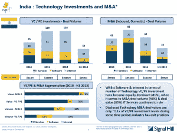

# 印度能创造 1000 亿美元的软件产品产业吗？

> 原文：<https://web.archive.org/web/http://techcrunch.com/2014/02/04/can-india-create-100b-software-products-industry/>

到目前为止，印度超过 1000 亿美元的 IT 产业主要建立在软件服务和后台办公项目上，这些项目由 TCS、Infosys 和 Wipro 为花旗银行和通用电气这样的公司提供，这些公司在过去的二十年里一直外包非核心工作以节省成本。

现在，新成立的软件产品智囊团 [iSpirt](https://web.archive.org/web/20230316050131/http://www.ispirt.in/) 称[软件产品到 2025 年在印度可能成为一个价值 1000 亿美元的产业](https://web.archive.org/web/20230316050131/http://www.ispirt.in/Media/Documents/iSPIRT_Press_Release_%20PIM_4Feb%202014.pdf)，这个雄心听起来可能过于乐观，但如果你考虑到包括 [InMobi](https://web.archive.org/web/20230316050131/http://www.crunchbase.com/company/inmobi) 、 [Zoho](https://web.archive.org/web/20230316050131/http://www.crunchbase.com/company/zoho) 、 [Druva](https://web.archive.org/web/20230316050131/http://www.crunchbase.com/company/druva-software) 、 [FusionCharts](https://web.archive.org/web/20230316050131/http://www.crunchbase.com/company/fusioncharts) 、[quick heal](https://web.archive.org/web/20230316050131/http://www.quickheal.co.in/)[在内的初创公司的进展，就不会过于激进例如，InMobi 的创始人纳文·特瓦里告诉我，InMobi 的收入每年增长超过 3-4 倍。这家初创公司的广告网络已经拥有超过 7 亿用户，仅次于脸书。](https://web.archive.org/web/20230316050131/http://www.quickheal.co.in/)

据 Nasscom 称，目前这些公司的年收入超过 20 亿美元。

iSpirt 今天发布了一份有趣的报告 ，报告涵盖了印度软件产品行业现状的一些重要细节——创始人来自哪里，他们是如何建立这些初创公司的，融资方面的挑战，平均估值等。

首先，在印度，为一家产品初创公司筹集种子资金很难，因为许多天使和风险投资人仍然不愿进行此类投资。该报告还强调了 SaaS 初创公司的崛起，如 Freshdesk 等，这些公司正寻求进入全球潜在价值超过 5000 亿美元的市场。

但印度的软件产品初创公司在为投资者提供退出渠道方面面临巨大挑战。根据 iSpirt 和 Signal Hill 去年的分析，虽然这些公司的平均成立时间约为 2.5 年，但从 M&A 退出的角度来看，印度的回报率非常低。

> “在以色列，M & A 的退出价值是同期 VC/PE 投资的 7 倍。在美国，这个倍数是 5X。在印度，它只有 1.1 倍(这也是被夸大了的，因为它把 it 服务也计算在内了)

随着越来越多的行业高管辞去轻松的工作成为企业家，甚至天使投资人，印度产品生态系统的情况开始发生变化。现在美国有 3000 多家中小型产品创业公司，与几年前相比，现在获得产品创意的种子资金更容易。

如前所述，脸书收购 Little Eye Labs 可能会引发并购退出的更好转变，但目前这些收购的规模太小。

这项研究是由斯坦福商学院的 Sharique Hasan、Rembrand Koning 和 Srivardhini K. Jha 共同完成的。可以肯定的是，这项研究只覆盖了印度大约 118 家产品初创公司，但它确实反映了当今生态系统的现状。

以下是 iSpirt 的产品行业监测报告中的一些主要发现，反映了印度软件产品初创公司及其创始人的现状:

*   印度软件产品初创公司的平均年龄只有 2.5 年。
*   这些创业公司中有一半以上是自筹资金，自我创业，很少得到天使和风投的帮助。
*   只有 14.1%的人获得过天使投资，获得风险投资的比例甚至更低(2.5%)。
*   大约 50%的印度产品初创公司估值在 100 万至 1000 万美元之间，其中近 34%的估值不到 100 万美元。
*   近 40%的软件产品创始人来自微软、英特尔、雅虎等跨国公司的 R&D 中心。
*   大约 78%的产品创业公司的创始人拥有相似的技能，他们在工程或销售能力方面没有带来任何多样性。
*   近 40%的初创公司有两位创始人，其中约 69%有创业经验。
*   大多数创始人(71%)都在三四十岁。

对于印度软件产品初创公司来说，更大的问题是，他们能否从该国超过 1000 亿美元的 IT 行业的错误中吸取教训，该行业似乎正在苦苦挣扎。与软件服务不同，在软件服务领域，像 TCS、Infosys 这样的公司在被打乱之前有更长的跑道(因为客户仍然依赖于低成本外包)，产品是一个不同的领域。这种破坏可能会更快、更无情。

对此，InMobi 创始人 Naveen Tewari 表示，产品创业公司 1000 亿美元的目标实际上是保守的，因为有几个问题需要解决，市场需要被扰乱。

“我认为目标是一个低门槛，应该更高，因为中断正在以更快的速度发生，提供了巨大的机会，”Tewary 说。