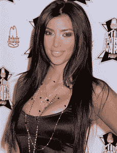

# ShoeDazzle 最终能让名人联合创始人有所回报吗？

> 原文：<https://web.archive.org/web/http://techcrunch.com/2010/12/09/can-shoedazzle-finally-make-celebrity-co-founders-pay-off-tctv/>

# ShoeDazzle 最终能让名人联合创始人有所回报吗？(TCTV)

 据 CrunchBase 报道，我们从来没有写过关于 18 个月大的[shoedazze](https://web.archive.org/web/20230203032700/http://www.shoedazzle.com/)的报道，尽管该公司已经在两轮融资中筹集了 2300 万美元，预计明年的收入将达到 1 亿美元，并且有金·卡戴珊作为联合创始人。

好吧，也许部分是因为最后一个因素。硅谷一直与洛杉矶有矛盾[，反之亦然](https://web.archive.org/web/20230203032700/https://techcrunch.com/2010/10/11/memo-to-aaron-sorkin-you-invented-this-angry-nerd-misogeny-too/)。实话实说:当 MySpace 被脸书收购时，我们很高兴，当一个名人在我们的游戏中失败时，我们会更加高兴。

但我不认为我们会有“鞋炫”的罪恶感。社交商务风靡一时，Jeremy Liew 称这家公司是他的投资组合中最被低估的。它是这样运作的:你注册这个网站，回答一个关于你的风格的有趣的调查。每个月 ShoeDazzle 的造型师都会为你挑选一些东西。这种模式的天才之处在于，每双鞋只需 39.95 美元，你可以跳过一个月，什么也不用付，也不会有任何影响。

ShoeDazzle 之所以如此便宜，是因为它自己制造和设计所有的鞋子，并允许名人和用户设计鞋子。这就像是 CD 俱乐部、Zappos、Threadless 和 H&M 的组合。

它是由布莱恩·李创办的，他的第一家公司 LegalZoom 计划明年上市。我在好莱坞找到了他，想了解更多关于这家公司的信息，以及他为什么说更多的洛杉矶初创公司不会成功。视频在下面。