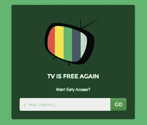

# 让我们结束对移动电视的搜索 TechCrunch

> 原文：<https://web.archive.org/web/https://techcrunch.com/2014/03/22/can-we-end-the-search-for-mobile-tv/>

手机电视从来就不是个东西。自从 1982 年的索尼守望者以来，我们一直对移动电视的前景感到兴奋，但是无论我们的设备有多好，似乎仍然缺少一些东西。就在今年 1 月，乔希·埃尔曼[向约翰·博斯威克](https://web.archive.org/web/20230130013440/https://twitter.com/joshelman/status/437703679924137984)指出，【2014 年主屏幕研究结果显示，即使是现在，也没有人在智能手机主屏幕上保留移动视频应用；我们甚至没有给 YouTube 或网飞最高收费。

这并不是说这两个应用程序不会产生大量的移动视频浏览量。但有趣的是，他们并没有将在移动设备上观看视频的平均时间增加到威胁传统电视机的程度。

你可能会说:当我可能只是在最大的屏幕上看电视时，我们为什么要关心在移动设备上看电视呢？我并不是说在手机上看电视的体验会更好，但我确实认为在手机上发现内容可能会更好。如果没有底层的内容推荐技术，移动设备可能有合适的约束来要求用户体验的真正改变。

因此，手机上的视频消费目前处于两个极端:1)当你在上厕所时，放慢你的滚动速度，等待 6 秒钟的视频加载；2)当我们需要延长我们在通勤途中的生命威胁剧狂欢时，从家里时移大量电视连续剧。

## 移动电视革命

第一次移动电视革命发生在 iPhone 出现之前的 2005-2008 年，当时只有少得可怜的数百万早期用户开始为高通的 MobiTV、MediaFLO 或威瑞森无线的 VCast 支付双倍费用。

当 CTIA 无线电视展仍是一件大事时，最大的业务之一就是电视网络与移动运营商会面，讨论电视内容许可协议。然而，一旦 iPhone 起飞，我们就完全忘记了移动电视，转而观看移动视频的黎明，这是由 YouTube 搜索和脸书和 Twitter 分享推动的，这使得 2012-14 年江南 style 的十亿次观看爆炸。

现在，将近 10 年过去了，可能是时候再次收听了。首先，我们需要区分“视频”和“电视”的含义。

> 如果没有底层的内容推荐技术，移动设备可能有合适的约束来要求用户体验的真正改变。

“视频”是指你看别人让你看的东西。“电视”是一个广播概念。当你打开墙上的电视、电脑或电话，然后开始观看时，我们可以将电视称为一种基于时间的体验。对消费者来说，电视的好处是换台并不困难，而且在你打开电视之前，你不必知道你想看什么。

当消费者花足够多的时间看电视，以至于在一次会话中看到不止一个视频时，电视体验对制片人来说变得有价值，因此可以有商业广告而不是前置广告。有了有线电视接口，换台就不值得了，因为上世纪 80-90 年代的换台消遣已经演变成扫描臃肿的菜单，这些菜单看起来像微软的 Project，不利于用遥控器导航。

然而，搜索并不是找到你从未听说过的节目的关键。例如，搜索“真正好的新电视”没有意义，自动推荐仍然不能令人满意。事实上，桌面上的整个搜索模式已经成为 Aol 和 Turner 这样的公司的一个容易的目标，他们通过在流量较大的页面上展示视频或通过 SEM 和 SEO 来获得更多关于视频的视图，这些视频可能是也可能不是最好或最相关的。

《纽约时报》的大卫·卡尔最近沉思道，优质电视内容的世界正在以越来越快的速度扩张。网飞推出整季悬疑电视剧的新模式足以让你疯狂观看，这只是优质内容爆炸的开始。

[Frederic Guarino](https://web.archive.org/web/20230130013440/http://www.huffingtonpost.ca/frederic-guarino/netflix-and-dvd_b_4175043.html) ，蒙特利尔精品电影制作战略和金融公司 MediaBiz 的业务总监，认为这是全球新来者浪潮开始与美国传统电视网竞争的时刻。[亚马逊](https://web.archive.org/web/20230130013440/http://www.bbc.com/news/entertainment-arts-26547236)，沃尔玛-Vudu 和苹果将很快被国际玩家如 Canal+，iTV，斯堪的纳维亚的 SVT 和 DR，甚至可能是中国的[阿里巴巴](https://web.archive.org/web/20230130013440/https://techcrunch.com/2014/03/11/alibaba-chinavision/)跟随。“你的普通电视剧爱好者现在淹没在优质内容中，不一定能够找到所有内容。”因此，如果有这么多的节目，但没有一家公司拥有最好的内容建议界面，行业将如何解决这个问题？

正如吉姆·巴克斯代尔[所说:](https://web.archive.org/web/20230130013440/https://twitter.com/pmarca/status/431220797818933248)“做生意赚钱有两种方式:你可以拆分，也可以捆绑。”

## 利用移动电视赚钱

YouTube 已经成功地将电视拆分成移动视频，而[多系统运营商](https://web.archive.org/web/20230130013440/http://en.wikipedia.org/wiki/Multiple-system_operator) (MSO)正试图将捆绑的视频转移到手机上，并称之为电视。像威瑞森和康卡斯特这样的 MSO 通过电视网络承载着几乎所有的优质内容创作者，而访问这些内容需要支付许可和认证费用。在其 2013 年第四季度的数字指数中，Adobe 表示，iPads、iPhones 和 iPods 产生了近 50%的对[电视无处不在](https://web.archive.org/web/20230130013440/http://en.wikipedia.org/wiki/TV_Everywhere)内容的播放请求。

我询问了原 MobiTV 团队的一个人，他在 2014 年尝试为家人解锁手机电视的经历，特别是作为一名家长:

> 电视无处不在已经取得了绝对的成功，因为它使媒体人能够把他们的内容放在付费墙后面，而不用向任何人重复收费；这是 MobiTV 订阅的问题之一，你必须从现有的有线电视套餐中单独购买移动内容。然而，你需要在你想要使用的每台设备上使用你的 MSO 进行认证，这需要你的威瑞森用户名和密码，你在他们连接你的那天就已经得到了…而且可能从那以后就没有使用过。在实践中，你在 iPhone 或 iPad 上安装应用程序，忘记它，然后当你实际上想要使用它时，你启动它并验证它，这需要几分钟，因此它扼杀了即时满足因素。

MSOs 和 YouTube 可能都太大，无法为移动电视创造令人愉快的新体验。最近[被 Stumbleupon](https://web.archive.org/web/20230130013440/https://techcrunch.com/2013/09/24/stumbleupon-acquires-5by/) 收购的[5by.com](https://web.archive.org/web/20230130013440/http://5by.com/)，使用一个情绪选择器来自动排列视频类别，它很好地理解了 YouTube 上的大量内容，否则这些内容永远不会被观看。Shelby.tv、Frequency 和 show 你可以添加来自脸书和 Twitter 的社交分享视频，以表明哪些视频应该进入你的播放列表，他们在应用程序中使用明确的交互，例如喜欢辨别受欢迎程度。

在这一领域积极进取的最大公司是雅虎，它为移动电视提供了两个强大的产品。收购 Tumblr 现在给了雅虎一台通过社交推荐收看电视的机器。在同一份 Adobe Q4 指数报告中，我们看到“从脸书或 Tumblr 转到体育相关网站的访问中，有一半会导致视频观看。”

Tumblr 团队还发现，电视品牌正通过动画 gif 获得更多关注。Tumblr 的媒体总监 Sima Sistani 认为这种行为完全是正常的。“假设我在仪表盘上，看到一张来自吉米·法伦最新说唱比赛的歇斯底里的 GIF。现在我被迷住了，我点击观看他网站上的视频。在一个随需应变的世界里，随时都有可能收听。”

> 有些东西必须改变，才能让在手机上同时观看多个视频变得愉快。

然而，即使有高增长，也只有 6%的视频开始来自社交媒体推荐，而且似乎仅限于目的地电视，如直播活动或广告良好的电视剧。雅虎屏幕是该公司的移动电视纯播放产品，玛丽莎·梅耶尔(Marissa Mayer)给 NBC 开了一张巨额支票，以便雅虎屏幕可以播放 [SNL](https://web.archive.org/web/20230130013440/http://www.nytimes.com/2013/04/25/business/media/saturday-night-live-archives-moving-to-yahoo.html?_r=0) 的后台目录。然而，挑战仍然存在，如果你真正想做的只是观看人人都知道的节目，如 SNL，那么雅虎仍然需要解决其余内容的发现挑战，特别是喜剧等非体育内容。

当我问脸书和其他社交网络是否会很快看起来更像电视平台时，5by [的创始人兼首席执行官 Greg Isenberg](https://web.archive.org/web/20230130013440/https://twitter.com/gregisenberg) 说，如果脸书不推出新的应用程序，这不太可能发生，因为移动应用程序需要提供单一用途的用户体验。

例如，即使是脸书的论文，它仅仅改变了脸书的阅读导航体验，也有足够的不同，需要一个新的应用程序，以免引起用户群的反感。但是，要让在手机上同时观看多个视频变得愉快，必须做出一些改变。有可能阻碍移动电视发展的一个因素是，当使用智能手机时，你实际上必须用你用来打字的同一只手握着屏幕，这一事实可能会告诉一个更微妙的 UX，它采用像“看到”这样的隐含指标，而不是“点击”

如果你看看最新的一批移动电视应用，一个新的、为他们所接受的界面正开始固化。所有应用都在朝着将用户界面最小化为简单的视频播放器的方向发展，这种播放器可以全屏显示视频，并具有“点击暂停”和“滑动”切换频道的功能。然而，这些应用程序的 UX 略有不同，一家尚未正式推出的名为 EndlessTV 的公司认为，其 UX 配方可以帮助它将潘多拉基因组的想法用于音乐，并使其适应你的移动电视。

## 广播电视的新模式

曾经被称为小费或跳过，一个“热或不热”的产品， [EndlessTV](https://web.archive.org/web/20230130013440/http://endlesstv.com/) 的团队去年转向视频实验。在过去的六个月里，他们已经部署了 15 个基于兴趣的电视频道应用，这将帮助他们创建和分析内容社区。此外，当 EndlessTV 在本月底推出其旗舰应用程序时，它将使用隐含的指标，如平均参与时间和观看百分比阈值，而不是视频观看、喜欢和分享的行业标准指标，来增强其内容建议基因组。

该公司希望这些基于参与度的指标与基于兴趣的渠道相结合，将使自动化变得可观察。此外，他们发现，试图为电视制作基因组与为音乐制作基因组之间的一个重大区别是，在许多情况下，尤其是新闻，电视需要某些内容的有效期。

在观看他们的 15 个应用程序和 25 万次下载(大多在 iOS 上)的数据时，EndlessTV 的另一项工作是争取电视制片人免费向他们提供优质内容，然后将其内容统一到一个应用程序产品中。因此，新的捆绑应用程序 [Voltron](https://web.archive.org/web/20230130013440/https://www.youtube.com/watch?v=1uS5b8aQ6z8) 的任务是实现最终的平衡，向用户承诺“电视又免费了”，并向电视制片人承诺免费电视又有利可图了。

EndlessTV 的首席执行官迈克尔·维克斯纳解释说:“EndlessTV 根据观众观看内容的时间长短，而不是中断广告的数量，与内容合作伙伴分享收入。”。“这创造了一个积极的反馈循环，观众可以获得越来越好的内容，内容合作伙伴可以获得更好的分发和货币化，以创造更有吸引力的内容。”

为了确保他们解决商业案例，EndlessTV 以广告的名义为应用程序做出了几个有趣的设计选择，并为他们的移动电视基因组获取最干净的数据。EndlessTV 从视频中省略了时间轴擦洗器，因此，通过设计，你不能调整你在视频中的位置，并且它删除了所有关于你正在观看的内容的标题。

通过确保用户只从视频的开头开始，他们可以了解每个视频的吸引力是如何基于跨越剪辑中的相关阈值和在每个特定剪辑上花费的时间，并可以对电视制片人说，“给我们你最有吸引力的视频”。像他们的竞争对手一样，on EndlessTV 电视广告只会在视频中间作为商业广告出现，而不是通过前置播放。

此外，通过要求用户在识别视频标题之前点击暂停视频，EndlessTV 在屏幕的一半上获得了一个额外的显示广告空间，用于标准的 300 x 250 T1，但不必求助于覆盖或中断内容。他们最喜欢的统计数据是，在他们打开他们新生的移动电视基因组后，他们能够将用户的会话时间比对照组延长 3 倍。

衡量 EndlessTV 及其其他移动电视竞争对手成功的标准是能够比 YouTube 更好地赚钱，因此门槛实际上相当低。但随着网飞用户群的增长，并继续收集大量数据，同时保持较低的订阅价格，这些免费的移动电视应用可能会成为电视网络和独立制作人的盟友，因为他们会重新考虑与 MSO 的联盟，并考虑自己的直接面向消费者的产品。证明像移动电视这样的概念是困难的，所以任何成功，比如让用户在主屏幕上有一个最喜欢的应用程序，都将是一个重大的胜利。

图片由[马克西姆卡巴口/Shutterstock](https://web.archive.org/web/20230130013440/http://www.shutterstock.com/gallery-810352p1.html)