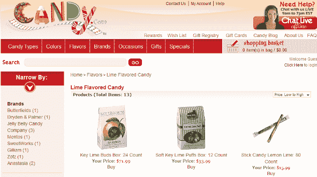

# Candy.com 在以 300 万美元出售域名后开店 TechCrunch

> 原文：<https://web.archive.org/web/https://techcrunch.com/2009/07/20/candycom-sets-up-shop-after-3-million-domain-name-sale/>

# Candy.com 以 300 万美元出售域名后开店

在域名[于六月以 300 万美元的天价](https://web.archive.org/web/20230124082510/http://techcrunch.com/2009/06/05/candycom-sells-for-a-sweet-3-million/)售出后，Candy.com 现在是一家崭新的网上商店，出售各种糖果。这个相当老派的网站提供了一系列的棒棒糖、软糖、口香糖、糖果棒和自动售货机，并运送到美国各地。

根据该网站的说法，Candy.com 甚至进行国际运输，但我认为他们只是不小心漏掉了“不”这个词(真的)。

candy 域名的新主人是 G&J 控股公司，一家位于马萨诸塞州韦茅斯的网络糖果零售商，自 2005 年开始营业。对他们来说，300 万美元的问题是:他们要多久才能弥补为公认的吸引力付出的[代价。com 域名？](https://web.archive.org/web/20230124082510/http://www.ricksblog.com/my_weblog/2009/06/inside-the-candycom-deal.html)

(向 [DNxpert](https://web.archive.org/web/20230124082510/http://www.dnxpert.com/2009/07/19/candycom-launched-an-industry-leader-in-the-making/) 脱帽致敬)

