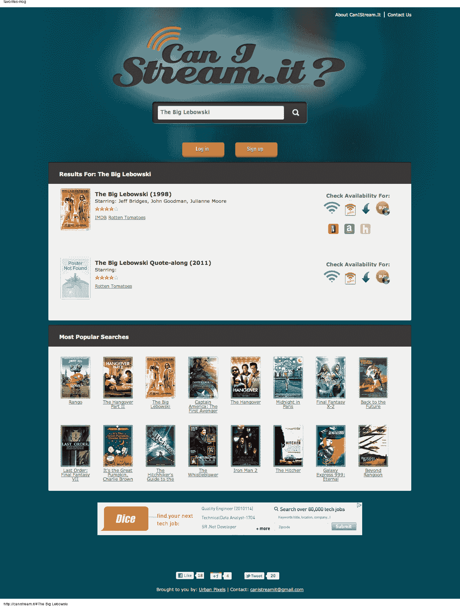

# CanIStream .它向你展示你可以在哪里观看、租借、下载或购买电影 

> 原文：<https://web.archive.org/web/http://techcrunch.com/2011/11/01/canistream-it-shows-you-where-you-can-stream-rent-download-or-buy-movies/>

# CanIStream .它告诉你在哪里可以流媒体，租赁，下载或购买电影

把这个网站加到你的书签里，因为我向你保证，在某个时候，你会需要它。CanIStream.it 是一个新的搜索引擎，它会告诉你在哪里可以观看、租借、下载和购买电影。该网站查询网飞、亚马逊、iTunes 和 Hulu 的图书馆，并提供相应目录的链接。如果没有电影，你可以注册 CanIStream.it，设置一个提醒，当电影的可用性发生变化时，该服务会向你发送电子邮件。

这项服务是总部位于纽约的技术咨询、品牌和设计公司 [UrbanPixels](https://web.archive.org/web/20230204214827/http://www.urbanpixels.com/) 团队的一个附带项目，他们说他们建立这个网站是因为他们需要这样的东西。(我们都是)。

由于所有的竞争服务，电影工作室和流媒体提供商之间不断变化的内容交易，以及[一些](https://web.archive.org/web/20230204214827/https://techcrunch.com/2010/02/16/warner-bros-redbox-rentals/) [工作室](https://web.archive.org/web/20230204214827/https://techcrunch.com/2010/02/03/netflix-new-releases/)做出的疯狂决定，即在 DVD 发行和流媒体可用之间强制执行 28 天的窗口，很难知道在哪里、以什么格式和何时可以获得什么。但现在你只需搜索 [CanIStream.it](https://web.archive.org/web/20230204214827/http://canistream.it/) 。

使用这项服务其实没什么大不了的——你只需输入一个查询，然后点击回车。每个搜索结果都有四个图标:一个是流媒体，一个是数字租赁，一个是下载，最后一个是你可以在哪里购买 DVD。点按您想要观看或购买电影的服务的链接，您将被重定向到该服务。就是这样。

我唯一的抱怨？如果他们也增加电视节目就好了。

UrbanPixels 的联合创始人 Alex Petrescu 表示，他们从事这项工作并不是为了钱，他们只是想打造一个社区使用的工具。

谢谢伙计们。

