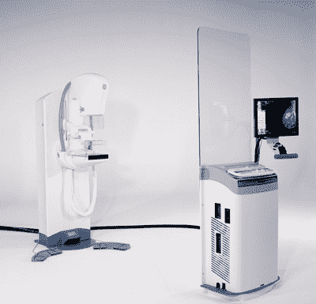

# 佳能开发 X 射线和无痛乳房 x 光设备 

> 原文：<https://web.archive.org/web/http://techcrunch.com/2010/07/02/canon-develops-x-ray-and-pain-free-mammogram-device/>

# 佳能开发 X 射线和无痛乳房 x 光设备

我们通常不会在 CrunchGear 上讨论医疗技术，但佳能目前在该领域开展的一项工作听起来非常有趣。据日本日经新闻报道，该公司开发了一种不使用 x 光就能帮助检测乳腺癌的机器(据[估计](https://web.archive.org/web/20230204202514/http://www.cancer.org/Research/CancerFactsFigures/BreastCancerFactsFigures/f861009-final-9-08-09-pdf) [PDF]仅在美国，每年就有大约 25 万名女性被诊断患有乳腺癌)。

佳能表示，与传统的乳房 x 光设备相比，其技术有两个优势:首先，它(显然)使患者免受辐射，其次，诊断是完全无痛的。这台机器是与京都大学的一个研究团队一起开发的，基于激光和超声波技术(这就是为什么它实际上不能被称为乳房 x 光设备)。

佳能表示，首批临床研究将很快在京都大学开始。该公司预计在三到五年内将这种机器商业化。

*图为常规乳房 x 光设备(抱歉，佳能尚未发布其新机的任何图片)。*