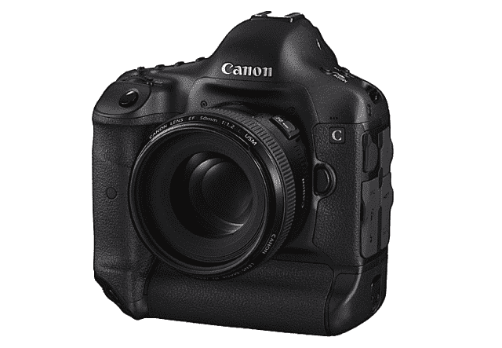

# 佳能在 EOS 上全力投入 C300 数字影院系统，新 DSLR 

> 原文：<https://web.archive.org/web/https://techcrunch.com/2011/11/03/canon-goes-all-in-on-eos-with-c300-digital-cinema-system-new-dslr/>

# 佳能在新 DSLR 的 C300 数字影院系统上全力以赴

在今晚的发布会上(RED 今晚也发布了他们的紧凑型高分辨率相机系统)，佳能展示了其新的 Cinema EOS 系统在数字电影领域的重要性。该系列的第一款相机是 C300，这是一款紧凑型相机，与预期相反，它不会产生 4K 图像。相反，他们专注于最大限度地发挥超级 35 尺寸传感器的性能，产生 1080p 的镜头。

对许多人来说，这个决议将是失望的，但佳能也有适合这些人的东西(尽管现在已经完全成型):DSLR 的“概念”，他们没有称之为 5D Mk III，但它似乎填补了这个角色，完成了 4K 录音:

这是一个使用 EOS 品牌和 EF 支架的专业而非超专业影院(即不是 10 万美元的相机)的新焦点，它建立在佳能在该领域的现有声誉基础上。[我几年前就注意到了 DSLR 传感器的问题](https://web.archive.org/web/20230205032127/https://techcrunch.com/2008/12/02/for-image-quality-buffs-dslr-video-is-off-the-table/)，看起来佳能的目标是保持优势，同时减轻劣势。

虽然 DSLR 在这一点上不太真实(尽管它可能只是缺乏最终的设计和制造)，但 C300 是真实的。

它以半传统的 RGBG 风格记录红色和蓝色通道的 1920×1080 图像和绿色通道的 1920×2160 图像，用于高达 24fps 和 50mbps 的 1080p 流。就数字而言，它与 RED's scarlet 相差甚远，后者以一半的价格提供了四倍的分辨率和八倍的数据速率。但规格并不代表一切，重要的是它们在现实生活中的表现如何。

C300 有 PL 和 EF 安装版本，将分别于 2012 年 1 月和 3 月上市，价格约为 20，000 美元。