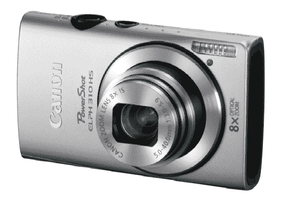

# 佳能推出新系列 PowerShot 数码相机 

> 原文：<https://web.archive.org/web/http://techcrunch.com/2011/08/23/canon-unveils-new-line-of-powershot-digital-cameras/>

# 佳能推出 PowerShot 数码相机新系列

没有什么比一个漂亮的小傻瓜更适合穿返校装了。因此，佳能的时机再好不过了。今天，新的 PowerShot 数码相机首次亮相，从它的外观来看，佳能已经覆盖了它的基地。

我们有三种新型号:PowerShot SX150 IS、PowerShot Elph 510 HS 和 PowerShot Elph 310 HS。最令人印象深刻的是 Elph 510 HS，佳能将其描述为“世界上最薄的数码相机(具有 12 倍光学变焦和 28 毫米广角镜头)。”一个大胆的说法，但 510 HS 似乎正在带来它。

三个射手共有的特征:

*   智能是:图像稳定系统，根据条件自动确定合适的拍摄模式
*   智能自动:根据 32 个预先确定的拍摄场景(只有 21 个用于视频拍摄)自动选择正确的设置
*   说到…三个摄像头都可以录制高清视频
*   iFrame 兼容性

这些坏男孩的价格在 250 美元到 350 美元之间，有各种形状和尺寸，颜色选择丰富(至少对小家伙来说是这样)。)我们来看看，好吗？

**佳能 PowerShot ELPH 510 HS**

【T2")

这无疑是三者中的佼佼者:超薄设计、触摸屏液晶显示屏和 1080p 视频捕捉。是的，所有的花里胡哨都考虑到了。以下是完整规格:

*   12.1 英寸 CMOS 传感器，12 倍光学变焦
*   28 毫米广角镜头
*   佳能的 HS 系统:结合了 1210 万像素的 CMOS 传感器和 DIGIC 4 图像处理器，在弱光环境下保持高质量的照片(310 HS 也是如此)
*   1080p 高清视频拍摄
*   高速突发模式:7.8 fps
*   3.2 英寸液晶触摸屏
*   触摸快门:轻按以对焦，释放以拍摄照片
*   颜色:黑色、红色和银色
*   建议零售价:349.99 美元
*   “十月初”有售

**佳能 PowerShot ELPH 310 HS**

【T2

接下来，我们有 510 HS 的小兄弟，Elph 310 HS。这是 Elph 型号中较便宜的一款，而且有多种颜色可供选择，我敢打赌它最终会落入许多青少年的手中。完整规格:

*   1210 万像素 CMOS 传感器，支持 8 倍光学变焦
*   28 毫米广角镜头
*   佳能的 HS 系统
*   1080p 全高清视频拍摄
*   高速突发模式:8.7 fps
*   3 英寸液晶显示器
*   颜色丰富:紫色、蓝色、粉色、绿色和银色
*   MRSP:259.99 美元
*   “10 月初”上市

**佳能 PowerShot SX150 是**

[")](https://web.archive.org/web/20230204114000/https://techcrunch.com/wp-content/uploads/2011/08/screen-shot-2011-08-22-at-11-44-32-pm.png)

最后，但并非最不重要的(但也是最不重要的，因为它是三个中最便宜的)，我们有 PowerShot SX 150 是。看一下规格:

*   12 倍光学变焦
*   28 毫米广角镜头
*   720p 高清
*   手动拍摄功能(光圈和快门优先)
*   3 英寸液晶显示屏
*   颜色:黑色和红色
*   建议零售价:249.99 美元
*   “九月初”上市