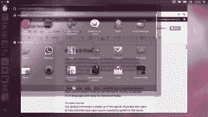
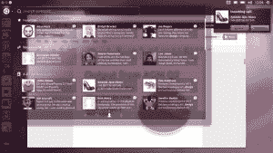

# Canonical 宣布面向 Android 的 Ubuntu 

> 原文：<https://web.archive.org/web/https://techcrunch.com/2012/02/21/canonical-announces-ubuntu-for-android/>

Canonical 今年早些时候推出的 Ubuntu TV 是一系列关于“设备上的 Ubuntu”的声明中的第一个。Canonical 统治世界的多屏战略中的下一款设备将于下周在 2012 年[世界移动通信大会](https://web.archive.org/web/20221206213151/http://www.mobileworldcongress.com/)上亮相，这是一款基于安卓系统的智能手机。不过，这并不完全是你想的那样。

这不是运行在 Android 上的 Ubuntu 应用程序。它也不是一个运行 Android 模拟器的全 Ubuntu 设备。相反， [Ubuntu for Android](https://web.archive.org/web/20221206213151/http://www.ubuntu.com/devices/android) 它是一个完整的 Ubuntu 桌面，在一个共享内核上与 Android 并行运行，提供对所有内容的上下文适当的访问。外出时，这款手机可以像其他安卓手机一样工作；但是当你将设备插入连接到显示器、键盘和鼠标的坞站时，你会得到熟悉的 Ubuntu 桌面体验。

我承认我认为这很新奇。这不是华硕的变形金刚试图用一个操作系统玩智能手机/笔记本电脑体验的两个方面。相反，它是一种全新的东西，试图为正确的环境利用正确的界面和体验。从大多数意义上来说，它是一部手机，但只有当连接到从它们受益的外围设备时，它才能激活 Ubuntu 桌面。

这有什么好处？我问了 Canonical 的首席执行官简·西尔伯这个问题。最直接的用例是企业用户:携带智能手机和笔记本电脑的人。Ubuntu for Android 将允许许多移动专业人士简化为一台设备。普通用户也会从这种融合中受益。根据 Silber 的说法，这允许“在正确的外形上获得正确的体验。”

这个 Android/Ubuntu 混血儿有什么好处？数据整合就是其中之一。你不需要复制你的地址簿，甚至不需要同步它:无论你是从 Android 手机应用程序中寻找一个电话号码，还是从 Ubuntu 电子邮件应用程序中寻找一封电子邮件，这两个程序都在查询同一个地址簿。这同样适用于存储在设备上的文档、媒体和任何其他内容。

另一个巧妙的技巧是:如果你通过 HDMI 将你的 Ubuntu for Android 设备连接到电视，你得不到 Ubuntu 桌面:你得到的是 Ubuntu 电视界面。您可以像使用任何 Ubuntu 电视设备一样，在手机上浏览媒体或访问在线内容。

西尔伯说，最终，这种混合方法减少了使用多种独立设备所需的心理“环境转换”。当你的 Ubuntu for Android 设备接入坞站，你正在编写电子邮件时，你仍然可以发送和接收文本和电话——事实上，还可以访问和启动手机上的所有 Android 应用程序——这意味着你不需要离开笔记本电脑就可以拿起和使用手机。你只需将鼠标移到来电指示器上，选择你想要的动作:接电话，挂断，等等。效率，为了胜利！

当我问西尔伯，他们还要多久才能把安卓踢到路边，发布一款全 Ubuntu 的手机，她只是说“我们不会在 2012 年 MWC 上宣布。”

与 Ubuntu 电视一样，Canonical 不会在下周推出一款可供购买的完整产品。他们正在展示他们开发的技术，并在寻找硬件合作伙伴。