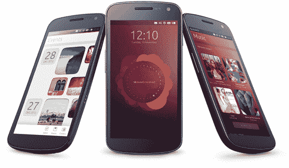

# 在调侃了其触摸友好的未来之后，Canonical 正式发布了 Ubuntu 手机操作系统 

> 原文：<https://web.archive.org/web/https://techcrunch.com/2013/01/02/canonical-brings-ubuntu-os-to-phones-official/>

【YouTube http://youtu.be/cpWHJDLsqTU?feature = player _ 嵌入式]

Ubuntu 在移动领域并不陌生——它在 2012 年初就开始展示其用于 Android 的 Ubuntu 项目，但它不会就此止步。在对其独特命名的操作系统触摸友好的前景进行调侃后不久，Canonical 正式拉开了其 Ubuntu 手机操作系统的帷幕，它看起来，嗯，*棒极了*。

这种美丽来自于这样一个事实，即它看起来并不像现在任何其他的移动用户界面——它避开了普遍存在于 iOS 和安卓系统中的传统应用网格概念，而是依靠横向滑动来查看常用的应用程序并在当前运行的应用程序之间切换。在某种程度上，它的方法更像 Windows Phone 8 和 Windows RT，而不是这两个领先的移动操作系统，尽管这些用户界面决定是否流行完全是另一回事。尽管如此，最终的结果是一个比其潜在竞争对手更宽敞、更广阔的界面，当硬件设计师努力平衡设备屏幕尺寸和便携性时，这是一个棘手的命题。

Ubuntu 的搜索功能也倾注了大量的汗水，这有点让人想起 Palm/HP 的 webOS。一个单一的搜索查询会产生来自多个来源的结果，Ubuntu 显然足够聪明，能够确定哪些结果最有可能是您正在寻找的。再加上对强大的语音命令的支持，以及与 HTML5 应用程序以及原生应用程序一起播放的能力，你就有了一个有趣的小产品。

现在，一个新的移动操作系统已经很棒了，但是如果没有合适的硬件与之配套，它几乎是无用的。不幸的是，这就是情况变得有点棘手的地方——Ubuntu Mobile 旨在与各种硬件兼容(除了更常见的 ARM 芯片外，它还支持 x86 处理器，并且不依赖于 Java 虚拟机)，但还没有任何关于设备合作伙伴关系的消息。相反，Canonical 创始人马克·舒托沃尔斯指出，首款基于 Ubuntu 的手机可能会在今年年底或 2014 年初问世。

当然，Ubuntu 最近的移动尝试提出了一些重要的问题，尤其是“谁会买 Ubuntu 手机？”如果 Canonical 的 CEO Jane Silber 是可信的，那么 Ubuntu 的吸引力不仅仅局限于 Linux 爱好者和企业。相反，我们也看到了用于电话、短信、网络和电子邮件的基本智能手机的机会，Ubuntu 凭借其原生核心应用和时尚的呈现方式在这方面表现出色。“原始设备制造商和运营商能够在移动设备上轻松修改和更名 Ubuntu，这当然没有坏处——Firefox OS 已经与 Telefonica 等运营商合作伙伴采取了类似的路线。

真正让我挠头的是 Ubuntu 将如何与它的竞争对手相抗衡(有很多竞争对手)。我不需要告诉你，苹果和谷歌正在用各自的移动操作系统进行智能手机展，参与者的名单比你想象的要多得多。Windows Phone 8 和 BlackBerry 10 最近可能引起了最多的关注，但 [Tizen](https://web.archive.org/web/20221209205710/https://beta.techcrunch.com/2012/12/30/samsung-and-docomo-reportedly-team-up-to-offer-tizen-smartphones-in-2013/) 、 [Firefox OS](https://web.archive.org/web/20221209205710/https://beta.techcrunch.com/2012/07/02/mozillas-boot-to-gecko-becomes-firefox-os-scores-support-from-sprint-deutsche-telekom-zte-and-more/) 和 [Sailfish](https://web.archive.org/web/20221209205710/https://beta.techcrunch.com/2012/10/04/jolla-confirms-it-will-unveil-sailfish-meego-based-os-next-month/) 背后的团队都在努力在移动领域留下自己的印记。

当我们问舒特尔沃斯这样做的动机，而不是支持现有的努力，如 Android 或 Tizen。“我们的视野比我从其他生态系统中看到的更深更广，”他说。“我们相信一个平台可以跨越多个环境”:从开发人员桌面到云服务器，再到最终用户所谓的“超级电话”

舒特尔沃斯诚实地承认，智能手机操作系统市场已经是一个拥挤的空间，但他相信 Ubuntu 的故事将呈现一个成功的命题。Canonical 无法与微软和 RIM 花费的数百万美元竞争，但根据舒特尔沃斯的说法，它可以在所有手机领域的一流界面上竞争。希望它能成功——我不禁觉得 Ubuntu 的方法太有趣了，人们不能完全忽视它。