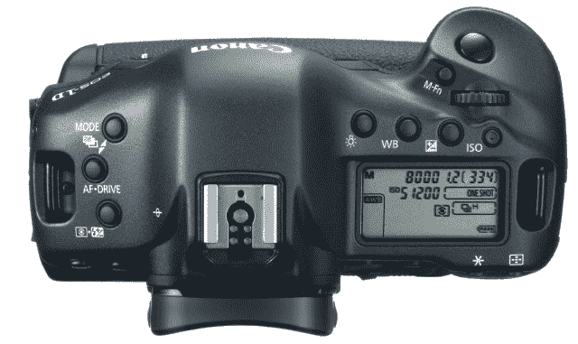

# 佳能新款专业 1D X 采用全画幅，改善视频质量 

> 原文：<https://web.archive.org/web/http://techcrunch.com/2011/10/17/canons-new-professional-1d-x-goes-full-frame-improves-video/>

佳能刚刚宣布了他们的旗舰产品 1D 系列专业数码单反相机的下一个版本，EOS-1D X。它几乎在所有方面都更快更好，很少有人会有幸使用它，因为它的价格不到 7000 美元。但是对于过去几年一直使用 1D Mk III 和 Mk IV 的人来说，这看起来是一次值得的升级。

几乎相机的每个方面都得到了改进。也许最适度的升级是百万像素计数。全画幅传感器为 1800 万像素，比 Mk IV 略高，但比佳能的其他全画幅相机要低。佳能表示，新的传感器产生的噪音比以往任何时候都少，并且使用了比 Mk IV 或 5D Mk II 更大的像素井。这些通过一组三个 DIGIC 5+图像处理器，我假设这是对现有 5 系列的小升级。它可以在 JPEG 模式下每秒拍摄 14 帧，或者在你写 raw 时每秒拍摄 12 帧。

ISO 从 100 到 51200，可以扩展到 204800。这太可怕了，尽管你可能不想把结果框起来。它还拥有一个新的 61 点自动对焦系统，以及类似 7D 上的自动对焦配置工具。

其中一个图像处理器专用于确定曝光，跟踪大量不同的区域，并有望产生更快、更准确的曝光。还有一种多重曝光模式，可以进行人们认为的 HDR，或者只是在复杂的光线条件下拍摄照片。一张照片你可以曝光九次，假设，我想，主体保持不动。

视频已经改进了不少。格式是通常的高清格式，帧率也一样，但他们已经向电影制作人群做出了让步，5D Mk II 在他们那里非常受欢迎。佳能改进了编码方法，因此您可以在所有 I 帧和正常压缩之间进行选择。时间码也更好，音量可以随时调整。现在你可以做更长的连续拍摄，长达半小时的视频，尽管由于文件系统的限制，它仍然会将其分成 4GB 的块。

最后，有一些人体工程学的改进和重新设计的快门和镜子机制。它内置了局域网连接器，而不是无线，这有点奇怪。当然，你可以买一个无线配件，还有一个 GPS。

整件事会花掉你 6800 美元。是的，这是一大笔钱——这些钱主要给了体育和自然摄影师，他们需要一切可能的优势来拍照。给孩子们拍照？这东西可能没必要。但我认为低预算电影制作人可能会发现它是 5D Mk II 的一个令人信服的替代品，假设优越的低光性能和减少莫尔条纹的说法得到证实。

可以在这里找到完整的新闻稿。不幸的是，我不认为我会回顾这件事。我太害怕我会掉了它。