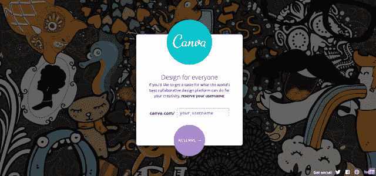

# Canva 筹集 300 万美元，让每个人都能使用设计

> 原文：<https://web.archive.org/web/https://techcrunch.com/2013/03/19/canva-raises-3-million-to-make-design-accessible-to-everyone/>

总部位于悉尼的初创公司 Canva 秘密建立了一个在线设计平台，今天宣布从 Matrix Partners、InterWest Partners、500 家初创公司和天使投资人那里筹集了 300 万美元的种子资金，其中包括谷歌地图创始人 Lars Rassmusen、Bill Tai(查尔斯河风险投资公司)和 Ken Goldman(雅虎首席财务官)。据 Canva 首席执行官 [Melanie Perkins](https://web.archive.org/web/20230306202422/http://au.linkedin.com/in/melanieperkins) 称，这家初创公司正从一个“令人难以置信的不同角度”着手协同设计，但她目前还不准备透露该产品的细节。

我们所知道的是，Canva 的想法是从 Perkins 之前的创业公司 Fusion Books 派生出来的，Fusion Books 是一个在线出版系统，用于制作 2007 年推出的学校年鉴。她与 Canva 的联合创始人和首席运营官·T4·克里夫·奥布雷特一起经营的这家公司目前拥有澳大利亚年鉴市场 10%的份额，最近还在新西兰和法国建立了业务。

“我们一直知道我们开发的技术比年鉴市场更强大，”珀金斯说。因此，去年夏天，该团队决定将这一概念推向更大的市场。她解释说，Canva 应该让每个人都能接触到设计。

“目前，如果你心中有一个想法，你想把它转化为设计，有大量的摩擦点，”帕金斯说。“除非你是专业设计师，否则创造一件东西——创造一个简单的设计——需要很长时间。”在联合创始人在 Fusion Books(现在有一个总经理在管理它)的时候，他们能够学到很多关于非专业人士如何进行设计，以及工具应该如何适应人们的自然工作流程。

有了 [Fusion Books 平台](https://web.archive.org/web/20230306202422/http://www.fusionyearbooks.com/)(专利申请[此处为](https://web.archive.org/web/20230306202422/http://appft1.uspto.gov/netacgi/nph-Parser?Sect1=PTO1&Sect2=HITOFF&d=PG01&p=1&u=/netahtml/PTO/srchnum.html&r=1&f=G&l=50&s1=20090327850.PGNR.))，用户不仅可以登录年鉴页面的文本，还可以在视觉体验上进行协作。例如，它将创建过程在线进行，而不是在年鉴团队中通过电子邮件发送页面。该系统为用户提供了访问页面背景、字体和布局的便捷途径。

“这种想法正在被移植到 Canva，但有更多的应用(不仅仅是年鉴)，”珀金斯说。Canva LinkedIn 的描述更加详细地说明了这在实际应用中可能意味着什么，称它可以用于“*设计你的脸书封面照片、新名片、演示文稿、咖啡馆菜单、客户业务手册……*”

然而，珀金斯告诉我们，Canva 不仅仅是将设计带给大众——它还将为设计专业人士提供产品。

该公司目前正在为新项目重建 Fusion Books 的技术，并使用 HTML5 作为网络和 iPad 支持的平台。该团队尚未决定是否要为 Canva 构建一个原生的 iPad 应用程序，但可能会考虑在未来这样做。

Canva 团队中有前谷歌员工和联合创始人 [Cameron Adams](https://web.archive.org/web/20230306202422/http://angel.co/themaninblue) 、[他之前的创业公司 Fluent 在](https://web.archive.org/web/20230306202422/https://techcrunch.com/2012/08/08/heres-what-happened-at-fluent/)[承诺](https://web.archive.org/web/20230306202422/https://techcrunch.com/2012/05/31/first-impressions-on-fluent-the-startup-promising-the-future-of-email/)破坏电子邮件后倒闭。前谷歌员工大卫·赫恩登也在船上，加入了悉尼九名全职员工的团队。

有了种子基金，Canva 将专注于推出其产品，首先在美国和澳大利亚同时推出，然后推广到全球。此外，Canva 计划如何利用其平台赚钱也尚未公开，但我们应该很快就会知道——公开亮相计划在 5 月份进行。与此同时，用户可以在这里注册 [waitlist](https://web.archive.org/web/20230306202422/http://canva.com/) 。