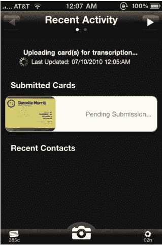

# CardMunch for iPhone 将您的名片手动转换为联系人 TechCrunch

> 原文：<https://web.archive.org/web/https://techcrunch.com/2010/08/04/cardmunch-for-iphone-converts-your-business-cards-into-contacts-%e2%80%94%c2%a0by-hand/>

# CardMunch for iPhone 将你的名片手动转换成联系人

 过去，我已经[写了](https://web.archive.org/web/20221206234706/https://beta.techcrunch.com/2008/08/27/we-need-to-kill-the-business-card-once-and-for-all/)很多关于我对名片的不屑——它们会增加混乱，当你真的需要查找某人的联系方式时，就像大海捞针一样。唉，它们仍然存在，但幸运的是，许多创业公司正在努力让它们变得更好。今天，一款名为 [CardMunch](https://web.archive.org/web/20221206234706/http://cardmunch.com/) 的 iPhone 应用发布了，它可以让你给一张名片拍照，并将其添加到你的 iPhone 联系人列表中。该应用程序售价 2.99 美元，有 10 个信用点(每输入一张卡需要一个信用点)。除此之外，每张卡大约需要 25 美分。

这并不是一个新的想法——我们最近写过类似的 [ScanBizCards](https://web.archive.org/web/20221206234706/http://www.mobilecrunch.com/2010/05/12/scanbizcards-use-your-iphone-3gs-to-organize-your-collection-of-business-cards/) ，还有很多其他的竞争者。这里的不同之处在于，CardMunch 实际上是让人类验证通过他们的系统提交的每张卡片——你将上传的每张照片发送给 Mechanical Turk 上的某个人，他会用手转换，而不是通过光学字符识别。考虑到确保这些联系信息的准确性是多么重要(电话号码或电子邮件地址中的错误数字会使它们变得毫无用处)，这实际上可能非常有用。

25 美分可能听起来有点贵，但它只比 Shoeboxed 的小批量计划贵一点点，每张名片大约 20 美分(但是，如果你扫描数百张名片，它会下降到每张 10 美分)。

