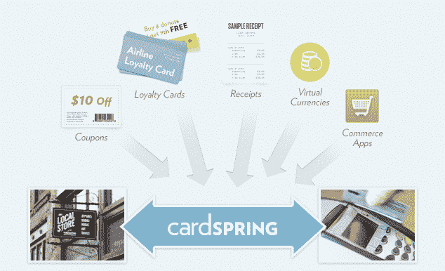

# CardSpring 筹集了 1000 万美元将支付连接到网络 TechCrunch

> 原文：<https://web.archive.org/web/https://techcrunch.com/2012/01/31/cardspring-raises-10-million-to-connect-the-payment-network-to-the-web/>

当涉及到网络时，我们测量每一次点击，但是在网络和现实世界之间仍然有一条鸿沟。然而，网络世界越来越多地驱动线下行为，尤其是在购买习惯方面。你在购买某样东西之前在网上或手机上研究过多少次？然而，当你去商店购买时，你在网上做的一切对商家来说都可能会消失。

不一定非要那样。当地商业的最后一英里实际上只是你伸出的手里的信用卡和在收银台刷卡之间的最后几英寸。该终端是支付网络的网关，今天支付网络并没有真正连接到互联网上。支付网络已经过时，并且基于自己封闭的标准运行。但是，如果连接到支付网络就像在网上开发应用程序一样简单，会怎么样呢？

这是一群前网景工程师和高管试图回答的问题，一家名为 [CardSpring](https://web.archive.org/web/20221207010312/https://cardspring.com/) 的新创公司今天发布了私人测试版。Cardspring 正在创建一个应用平台，允许网络和移动开发者为信用卡和其他类型的支付编写应用程序。Cardspring 一方面以一种安全的方式连接到支付网络，另一方面作为一个平台，开发者可以通过网络标准 API 创建支付应用。它是两个网络之间的桥梁。

这些应用可能包括电子优惠券、积分卡、虚拟货币或尚待想象的商务应用。例如，您可以在网上获得 10 美元的优惠券，输入您的信用卡号，然后当您去商店用该卡付款时，支付网络会识别该卡并给您 10 美元的信用。或者你可以刷一下你的卡，它会把收据用电子邮件发给你。或者它可以帮你登记。刷卡会触发一个应用程序。你看到的是一块塑料。网络看到的是一个应用。

如果这听起来有点像 Groupon、 [LivingSocial](https://web.archive.org/web/20221207010312/https://beta.techcrunch.com/2012/01/29/livingsocial-ceo-lumping-groupon-ebay-amazon/) 、[、Foursquare](https://web.archive.org/web/20221207010312/https://beta.techcrunch.com/2011/10/20/fouresquare-ceo-dennis-crowley-the-daily-deal-companies-are-version-1-0/) 、square 或谷歌正在尝试做的事情，那是因为它们都在试图以不同的方式破解这个难题。他们都想[结束数字优惠和店内支付之间的兑换循环](https://web.archive.org/web/20221207010312/https://beta.techcrunch.com/2011/07/24/redemption-loop-local-commerce/)。“Groupon 用优惠券穿针引线，”首席执行官 Eckart Walther 说，但在他看来，日常交易只不过是“美妙的一次性解决方案——我们实际上是在支付网络内部。”

瓦尔特曾负责网景的平台组。他后来去了 TellMe Networks，Yahoo search，LiveOps，最后成为 Accel 的 EIR。该公司的首席技术官是杰夫·温纳，他曾是网景公司的首席加密专家。他在开发 SSL(浏览器中的标准安全层)等方面得到了帮助。Cardspring 已经从 Accel 和 Greylock 获得了 1000 万美元的首轮融资(Accel 的 Andrew Braccia 和 Greylock 的 James Slavet 是这笔交易的合作伙伴)。其他投资者包括 SV Angel(它是 Online2Offline 趋势的忠实信徒)、Morado Ventures、Felicis Ventures 和 Maynard Webb 的投资工具 WIN。

Groupon 并不是一次性解决方案的唯一尝试。Foursquare 将其商户特价与美国运通卡购买相关联，但并非每张卡都是如此。谷歌钱包试图将支付应用程序植入你的手机。太支离破碎了。"每天都有一个小型平台试图推出."他说。相反，CardSpring 正在解决这个问题，就像你所期望的一群 Netscape 工程师会做的那样:在网络层。“如果我们能将浏览器平台引入支付网络，会怎么样？沃尔特问道。

试着让你的大脑思考一下。你的塑料信用卡可以触发不同的应用——优惠券、忠诚度奖励、提醒、入住，应有尽有。所有这些都是安全的，并且基于您允许每个应用程序拥有的权限(作为某种好处的回报)。“互联网的一个根本挑战是，它无法有效地捕捉它在现实世界中为商业创造的经济价值，”布拉西亚指出。" CardSpring 的平台使线下商店能够轻松衡量网络对其业务的影响."

对这种类型的支付平台有巨大的需求。Groupon 可以用它来最终跟踪优惠券的兑现情况，而不必将装有特殊软件的 iPads 运送到酒吧和餐馆。Foursquare 可以将它与它的特价商品联系起来，实际捕捉购买数据，然后在他们的仪表板上向商家展示。LivingSocial 也可以。

这只是开始。想象一下按动作计费的广告，其中的动作是店内购买。可能性是无限的。不仅如此，任何获取信用卡信息的网站或移动应用程序现在都有机会将数据附加到这些购买中，并向支付网络读写数据。这不仅仅是转移资金，而是转移支付相关的数据。最终，这些数据可能会变得更有价值。

困难的部分将是说服消费者交出他们的信用卡号码，以便这些应用程序能够工作。就像 Groupon 或 LivingSocial 一样，最初的网站和应用程序已经保存了消费者的信用卡信息，这应该不是问题。但是，当不知名的网站或企业开始要求这些信息时，它们可能就不会那么乐意了。

尽管如此，这里还是有很多唾手可得的果实，Cardspring 为这个难题带来了一个聪明的方法。它对消费者或商家的要求不高。他们不需要任何新技术或花哨的 NFC 手机或终端。他们需要的只是他们的信用卡。网络会完成剩下的工作。

