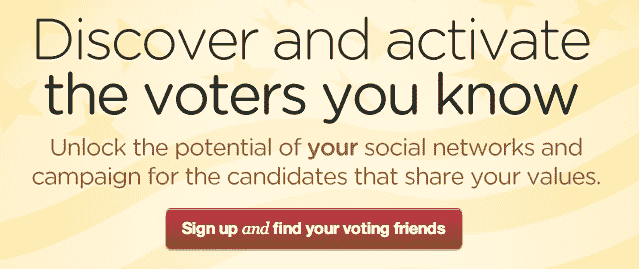
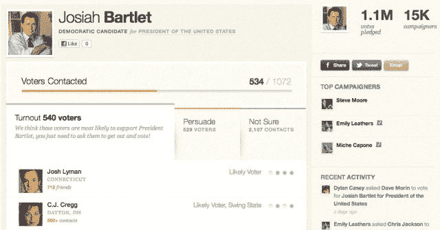
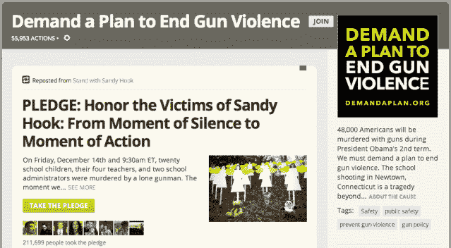
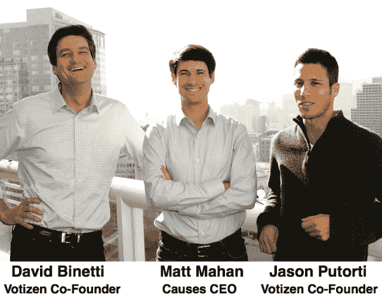

# Causes 收购 Votizen 以实现民主

> 原文：<https://web.archive.org/web/https://techcrunch.com/2013/01/10/causes-acquires-votizen/>

激进主义平台[起因](https://web.archive.org/web/20230329034524/http://www.causes.com/)刚刚收购了政治倡导初创公司 [Votizen](https://web.archive.org/web/20230329034524/http://www.crunchbase.com/company/votizen) 。Causes 拥有庞大的 1.86 亿用户群和 Votizen 的工具，它们将一起打破公民参与的障碍，让任何人都可以影响选举。由共同投资者肖恩·帕克谈判达成的这项协议给人们提供了一种投票给支持他们热爱的事业的候选人的方式。

我最近通过我的消息来源听到了收购 Votizen 的原因，两家公司的领导人同意就收购接受采访，收购将于今天晚些时候正式宣布。收购价格未披露。[ **更新**太平洋标准时间 2013 年 1 月 10 日上午 10:50:voti Zen 自[发表了一份脸书声明](https://web.archive.org/web/20230329034524/https://www.facebook.com/notes/votizen/votizen-and-causes-are-joining-forces/580105002003042)确认了此次收购。它详细说明了 Votizen 的网站现在已经被关闭，所有个人数据记录都将被销毁，尽管以前的用户仍然可以收到电子邮件提醒。]

#### 实现同一愿景的两种方法

由肖恩·帕克和乔·格林创建的 Causes 于 2007 年作为脸书的一款应用程序推出，目的是在社交网络中应用口碑传播来产生社会影响。从那时起，它已经注册了 1.86 亿用户，他们向 6 万个非营利组织捐赠了超过 5000 万美元。他们还修改了法律，建立了新的非营利组织，组织了服务旅行等等。

一路走来，Causes 对 Jason Putorti 产生了兴趣。在 Mint 于 2009 年被 Intuit 收购之前，他是 Mint 的一名备受称赞的设计师。后来，Causes 试图雇用他，但他开始 [Votizen](https://web.archive.org/web/20230329034524/http://www.crunchbase.com/company/votizen) 代替。“我想立即追求政策空间，但原因还没有出现，”Putorti 告诉我。

Votizen 允许人们在脸书或 Twitter 上登录，看看他们的哪些朋友注册投票了。你选择一个你支持的候选人，Votizen 告诉你哪些朋友有资格投票，你应该提醒去投票。它还会为您创建一个配置文件，其中包含从公共记录中提取的经过验证的选民文件。这向候选人表明你是民主的严肃参与者。

一年后， [Votizen 在 2010 年从全明星投资者那里筹集了 125 万美元的初始资金，其中包括 500 Startups、Felicis Ventures、SV Angel、Shervin Pishevar 和 Keith Rabois。创始人基金增加了一大笔资金，合伙人肖恩·帕克加入了 Votizen 董事会。最终，沃蒂森从帕克、阿什顿·库彻和其他一些名人那里又获得了 75 万美元的可兑换纸币。](https://web.archive.org/web/20230329034524/http://www.crunchbase.com/company/votizen)

在 Putorti 和联合创始人 David Binetti 的领导下，Votizen 成功建立了一个超过 2 亿选民的数据库，并召集了 5000 多次竞选活动。然而，在选举周期之外，很难获得新用户。Votizen 有巨大的潜力将对某项事业的兴奋转化为政治影响，但它需要更多的传播。

与此同时，Causes 在激发轻量级的“点击行动主义”方面表现出色，但需要一种方式来利用运动的势头，在教育、保护和人权等问题上产生相当大的影响。根据 AppData 的数据，这个月有 1000 万人活跃在 Causes 上，这意味着还有很多人需要重新激活。

自从第一次接触到 Putorti 以来，Causes 推广了 Matt Mahan，他告诉我该公司“学会了问题行动主义是政治参与的垫脚石。有些人会参与政治活动，但也有很多人会卷入个人问题(比如主持人的问题)。我们想向他们展示，自然的最终结果是采取某种政治行动。”

#### 合力

通过帕克，Causes 开始与 Votizen 进行收购谈判。马汉解释说，“去年我们有 6500 万个公益行动。如果它连接到 Votizen，它们的影响将是 10 倍。”此外，马汉认为，有这么多令人着迷的创业公司，很难招募到像 Votizen 这样强大的团队。

比内蒂告诉我，联合起来非常有意义。“这项协议让我们有可能接触到美国的每一位选民，感动美国的每一位选民。这是一个巨大的机会，我们不会错过。”虽然这两家公司都在努力产生社会影响，但它们肯定都是营利性企业，希望通过重组激进主义来获得收入。

此次收购整合了不同的优势，以实现共同的目标。Votizen 可以重新吸引 Causes 的潜在用户群，让他们承诺投票给支持他们捐赠和志愿服务的事业的候选人。

现在，人们比以往任何时候都更需要感觉到自己在政府中有发言权。马汉说:“在现实世界中，我认为民主正在挣扎。犬儒主义、参与率下降，以及不相信我的个人行动有意义。真的，我们正处在一个公民在线参与的新时代的门口。我们希望成为服务于此的技术平台。”

整个 Votizen 团队将立即在旧金山的 Causes 办公室开始工作。它将整合他们的产品，在支持一项事业和实现目标之间建立一座桥梁，为代表它立法的政治家投票。

例如，Causes 用户采取了三百万次行动支持桑迪胡克“[全球同情卡](https://web.archive.org/web/20230329034524/http://www.causes.com/sandyhookcard)”和“[桑迪胡克默哀](https://web.archive.org/web/20230329034524/http://www.causes.com/causes/807161-stand-with-sandy-hook/actions/1716727)。马汉说，“随着 Votizen 选民文件整合的加入，这 300 万项行动将在华盛顿特区和全国各州产生更大的影响。“那是因为选民档案向政客们表明”这不仅仅是一些签名。比内蒂解释说:“这是他们选区的真正选民，他们将投票支持或反对他们。

现在的问题是，Causes 和 Votizen 一起是否能让行动主义具有足够的吸引力，以跳过政治进程中的疲惫。

#### 权力是你的

在他的几次公开演讲中，肖恩·帕克阐述了他的立场，即一个授权的人际网络可以产生巨大的影响，而在政治方面，可以从最富有的人那里夺回这种影响。在 2011 年 11 月的科技经济大会上，帕克说:

> 我与两家投资公司 Votizen 和 Causes 一起探索的是，事实上我们在 Causes 的口号是“个人赋权”，是…试图利用社会资本来实现某种社会变革，无论是在选举政治、行动主义、倡导还是筹集资金方面。真正有趣的是聚合力量。最终，金钱在政治中的目的是作为选票的代理。如果你能找到一种更有效的方式以投票的形式聚集权力，你就能从这个系统中去除金钱。

此次收购联合了帕克的两家公司，并加强了他旨在民主化民主的业务组合，其中也包括竞选组织工具 [NationBuilder](https://web.archive.org/web/20230329034524/http://nationbuilder.com/) 。帕克告诉我，“通过将 Votizen 的选民文件集成到 Causes 平台，Causes 扩展了其现有的将在线行动主义与现实世界的变化联系起来的能力。我们的两个团队非常契合，合并将创造出一个更强大的技术和设计人才梯队，例如 Jason Putorti 加入我们的设计团队。”

Causes 和 Votizen 可以一起帮助我们找到我们热衷的问题，让我们参与进来，并确保我们的投票提供解决方案……如果它们可以打破我们的冷漠。无论是在美国还是在国外，都有大量的工作要做。比内蒂总结道:“民主是一个不断增长的行业。这只有一个方向，那就是更多。”

*[形象信用](https://web.archive.org/web/20230329034524/http://captainplanetfoundation.org/)*