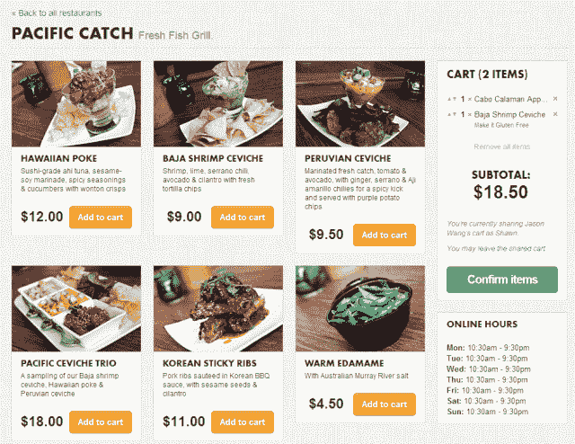

# 策划食品配送服务 Caviar 向公众开放并推出团体订购 

> 原文：<https://web.archive.org/web/https://techcrunch.com/2013/03/11/caviar-public-launch/>

去年 9 月，我们告诉你关于[鱼子酱](https://web.archive.org/web/20221004155122/https://www.trycaviar.com/)的事情，这是一家[送餐服务](https://web.archive.org/web/20221004155122/https://beta.techcrunch.com/2012/09/20/former-munchonme-team-launches-caviar-a-curated-seamless/)公司，直接与旧金山的一流餐厅合作，在不到一小时的时间内以 9.99 美元的固定费用将他们的食物送到。这项服务现在已经退出了只接受邀请的测试期，并且刚刚推出了一个团体订购功能，允许用户快速方便地与他人分享他们的购物车。

现在已经有很多送餐服务，包括像 Seamless 和 GrubHub 这样的公司，它们将用户与拥有自己送餐人员的餐厅联系起来。然后是 Postmate's Get It Now 服务，该服务承诺在下订单后一小时内快速交付几乎任何东西。

Caviar 试图让自己与众不同，它使用自己的送餐员，从一份精心挑选的餐厅名单中提供统一价格的快速送餐服务。为了做到这一点，它与镇上的许多地方合作，只与没有自己送货队伍的高评级餐厅合作。

这使得它可以做一些其他公司做不到的事情:例如，Caviar 的用户可以安排以后的订单，而不是所有的交付都是即时进行的。这样一来，知道自己要吃大型集体午餐的办公室可以提前预订，或者希望享受浪漫晚餐的用户也可以提前预订。

该计划允许它与餐馆合作，让快递员在饭菜做好后的五分钟内出现，确保食物是最新鲜的，并且送货的人不会浪费时间等待它烹饪。用户还可以实时查看他们的订单在哪里，以及预计何时送达。Caviar 的联合创始人王凯峰告诉我，从餐厅到用户家中平均需要 17 分钟。

由于它是与个别餐厅合作的，Caviar 还确保他们所有的菜单项都被清晰地呈现出来，并派出一名摄影师去捕捉他们选择的图像。现在有 20 多家餐厅提供这项服务，还有 1000 多种菜单可供选择。

与餐馆合作也有助于它管理大量订单，并扩大到一次订购数十甚至数百个项目。除此之外，Caviar 还有一个功能是支持团体订购，简化了多个用户一起订购时决定他们想要什么的过程。

通过群组订购，用户可以简单地与其他人共享他或她的订单的链接，其他人将被通知将他们自己的商品添加到一个购物车中。一旦下了所有订单，最初开始下订单的人可以选择在签字交付之前查看东西。

群组订购功能是新增功能。面向大众推出鱼子酱也是一项新举措。虽然自去年夏天以来，该服务一直处于仅限受邀者的测试期，但现在它已经开放，允许任何人注册并开始下单。此外，每单收取 9.99 美元的固定费用，就能让食物在一小时内送达——无论是单人还是多人。

Caviar 团队由三名创始人组成，他们是 2011 年夏季 Y Combinator 班的一部分，去年他们已经将之前的公司“吃我吧”出售给了大学预算。由于平均订单规模超过 80 美元，他们迅速种植了鱼子酱，甚至在私人测试中，月收入超过六位数。现在它已经向公众推出，并使团体订购更加容易，他们预计这些数字会增加。