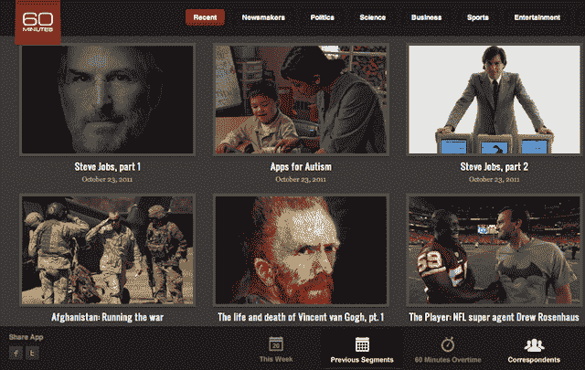

# 哥伦比亚广播公司推出“60 分钟”Chrome 网络应用程序，包括对史蒂夫乔布斯传记作者 TechCrunch 的采访

> 原文：<https://web.archive.org/web/http://techcrunch.com/2011/10/26/cbs-launches-60-minutes-chrome-web-app-features-interview-with-steve-jobs-biographer/>

# 哥伦比亚广播公司推出“60 分钟”Chrome 网络应用程序，包括对史蒂夫·乔布斯传记作者的采访

在我看来，这是一个有趣的实验， [CBS](https://web.archive.org/web/20230203102720/http://www.cbsnews.com/) 今天早上推出了一个“60 分钟”应用程序，你可以在 Chrome 网上商店中找到并启动[(该商店刚刚对](https://web.archive.org/web/20230203102720/https://chrome.google.com/webstore/detail/imjhdahelgojehmfmkmdfjcpfbglbfmj)[进行了重大改造](https://web.archive.org/web/20230203102720/https://techcrunch.com/2011/10/25/google-gives-chrome-web-store-a-welcome-new-lick-of-paint/))。

当然，“把它添加到 Chrome”并没有真正做什么，只是把你带到这个页面，你可以在 Chrome 中打开它，就像你打开任何页面一样，但是这个 Web 应用程序看起来确实很不错。

Chrome 应用程序由 HTML5 和 CSS3 动画支持，提供“60 分钟”节目内容的高质量视频，从最近播出的对史蒂夫·乔布斯传记作者沃尔特·伊萨克森的采访开始。如果你没听说的话，他的书最近上市了。

哥伦比亚广播公司表示，该应用程序还将展示“60 分钟”在线系列[60MinutesOvertime.com](https://web.archive.org/web/20230203102720/http://60minutesovertime.com/)的先前片段、剪辑和新的原创内容。

用户可以通过新闻人物、政治、科学、商业、体育、娱乐和自然等类别以及记者来浏览细分市场。

