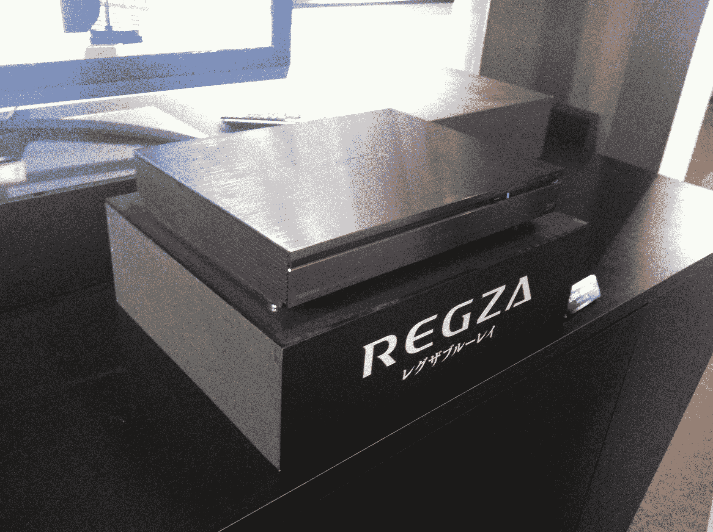

# CEATEC 2011:东芝硬盘/蓝光服务器记录 6 个频道 15 天的数字电视 

> 原文：<https://web.archive.org/web/http://techcrunch.com/2011/10/04/ceatec-2011-toshibas-hddblu-ray-server-records-15-days-of-digital-tv-from-6-channels/>

# CEATEC 2011:东芝的硬盘/蓝光服务器记录 6 个频道 15 天的数字电视

你有一个硬盘/蓝光录像机连接到你的电视，但从来没有足够的空间？那么东芝的 REGZA DBR-M190 可能会满足你的需求(至少如果你住在日本的话)。与 CEATEC 2011 上的大多数设备一样，该记录器是由该公司在展览前提前宣布的。

DBR-M190 拥有不低于 5TB 的存储空间:根据东芝公司的说法，4TB 是为时移功能预留的，这允许用户在 15 天内同时录制多达 6 个地面数字频道(剩余的 TB 可用于存储其他节目)。

我无法在今天的东芝展台上检查内容压缩的质量，但买家可以选择更短的录制时间和更好的质量。所有存储的程序都可以复制到外部硬盘上。

【T2

内置的 REGZA 链接共享功能不仅可以在电视上观看内容，还可以将内容传输到其他设备，例如兼容的东芝平板电脑或智能手机(这就是为什么 DBR-M190 实际上被称为“REGZA 服务器”)。

该设备兼容 3D 蓝光光盘，将于下月在日本上市(售价:2600 美元)。一款精简版的 DBR-M180，拥有 2TB 的时移空间和 500GB 的常规存储空间，将让买家花费 1950 美元。