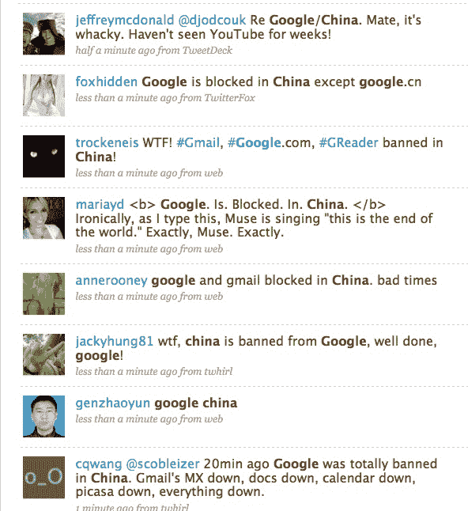

# 审查 2.0:中国屏蔽谷歌搜索、应用、Gmail 等

> 原文：<https://web.archive.org/web/https://techcrunch.com/2009/06/24/censorship-20-china-blocks-google-search-apps-gmail-and-more/>

# 审查 2.0:中国屏蔽谷歌搜索、应用、Gmail 等

中华人民共和国显然已经禁止其公民访问谷歌的许多资产，包括主要的搜索引擎、谷歌应用程序、谷歌阅读器和 Gmail。在推特上搜索(首选标签似乎已经变成 [#fuckgfw](https://web.archive.org/web/20230404090848/http://search.twitter.com/search?q=fuckgfw) )发现许多中国人在抱怨，尤其是无法使用搜索引擎，尽管似乎在这一点上仍然可以联系到 Google.cn。

中国真的有人能在评论中证实这一点吗？就我们使用诸如 [WebsitePulse](https://web.archive.org/web/20230404090848/http://www.websitepulse.com/help/testtools.china-test.html) 这样的工具来看，许多谷歌服务在这一点上被有效地屏蔽了。我们还交叉测试了雅虎、Twitter、脸书和必应(Bing)等其他受欢迎的美国服务，这些服务目前似乎仍然可以访问。

在美国东部时间上午 10 点左右，屏蔽服务似乎对用户变得很明显。我们已经联系了谷歌请其置评。

**更新:**一个看起来住在中国厦门的人说，谷歌图书、Google Talk 和图片搜索在这篇文章的评论区也被屏蔽了。据报道，博客搜索、翻译、地图和分析等其他服务也遭到了攻击。YouTube 在中国被屏蔽已经有一段时间了。

我们应该注意到，这让人想起最近天安门事件周年纪念日前夕屏蔽 Twitter 和 Bing 的事件。CrunchGear 过去曾指出，总体而言，中国的审查制度正变得越来越复杂。

本周早些时候，FastCompany [报道称](https://web.archive.org/web/20230404090848/http://www.fastcompany.com/blog/clay-dillow/culture-buffet/google-agrees-further-restrict-search-results-china)谷歌与中国就可能出现在谷歌中文网站搜索结果中的色情内容发生冲突。这家搜索巨头随后同意“采取一切必要措施”确保这一问题在适当的时候得到解决。也许他们对国家官员来说行动不够迅速，因此在这场争论中被关闭了？

不管怎样，无论你怎么看，这都是一项严厉的措施。

**更新 2:** 东部时间上午 11:05——有报道称，谷歌的一些服务已经恢复

