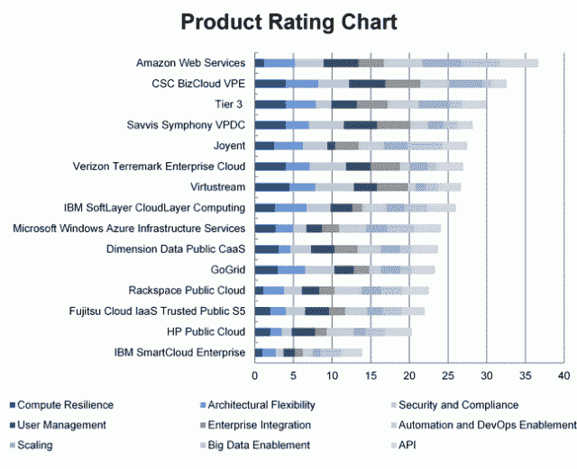

# CenturyLink 收购 Tier 3，即基础设施、平台和高级云管理提供商 

> 原文：<https://web.archive.org/web/https://techcrunch.com/2013/11/19/centurylink-buys-tier3-the-infrasructure-platform-and-advanced-cloud-management-provider/>

# CenturyLink 收购 Tier 3，即基础设施、平台和高级云管理提供商

CenturyLink 收购了总部位于西雅图的基础设施即服务(IaaS)、平台和高级云管理公司 [Tier 3](https://web.archive.org/web/20230130233955/http://www.tier3.com/) 。收购金额没有披露。Tier 3 获得了来自英特尔投资、Ignition Partners 和 Madrone Venture Group 的 1850 万美元投资。

这是 CenturyLink 去年第二次收购云服务。6 月， [CenturyLink 收购 AppFog](https://web.archive.org/web/20230130233955/https://techcrunch.com/2013/06/13/centurylink-acquring-appfog-to-move-into-platform-as-a-service-market/) ，标志着其进入平台即服务(PaaS)市场。

通过此次收购，Tier 3 将成为 CenturyLink 云的一部分。西雅图将作为新世纪链接云集团的总部。西雅图正成为云服务提供商的磁石。亚马逊网络服务、Windows Azure 和谷歌计算都在西雅图地区开展业务。

购买 Tier 3 主要是为了 CenturyLink 深化其通过 Savvis 提供的基础设施产品，Savvis 是电信巨头 2011 年收购的。第 3 层的 9 个数据中心将与 Savvis 拥有的 55 个数据中心集成。CenturyLink 明年将增加两到四个数据中心。Tier3 还有一个名为 Web Fabric 的 PaaS 产品，它基于 Cloud Foundry，即现在由 Pivotal 管理的开放 PaaS。

通过收购 Tier 3，CenturyLink 收购了市场上最受认可的云提供商之一，在 Gartner Research 幻方图中排名靠前。

 第 3 层以其管理复杂工作流程的能力而闻名。它具有云服务的核心特征。它是可扩展的、弹性的、由管理界面统一的自助式云服务。

例如，在 8 月份，我报道了 [Tier 3 如何为架构师推出了在公共云中设计网络配置的功能](https://web.archive.org/web/20230130233955/https://techcrunch.com/2013/08/14/tier-3-pushes-for-self-service-to-drive-down-the-overall-costs-of-the-cloud/)，该功能在很大程度上反映了内部数据中心常见的网络。借助该功能，第 3 层认为客户可以以安全、合规的方式将企业应用程序迁移到云中。新功能包括 Tier 3 所描述的为客户创建和管理 web 应用程序负载平衡器的能力、用于构建安全系统的虚拟局域网、站点到站点虚拟专用网络和用于边缘防火墙的定制 IP 端口。

第 3 层提供的高级编排功能使 CenturyLink 成为市场上最复杂的基础设施之一。它将允许 CenturyLink 将其 Qwest 托管、Savvis 协同定位和 Tier 3 基础设施云服务集成到一个包中。AppFog 将被添加到 CenturyLink 云环境之上运行。

第 3 层赋予 CenturyLink 深入企业的能力。正如我今年早些时候提到的，AWS、谷歌计算引擎和 Windows Azure 都是可编程的，但要让这些服务运行起来，很多都是手工操作。

Tier3 联合创始人兼首席技术官 Jared Wray 说，这给已经紧张的 IT 预算增加了人力资本成本，他将成为新世纪链接云的首席技术官。

总而言之，CenturyLink 面临着来自 Windows Azure 等其他基础设施提供商的激烈竞争。但是，PaaS 和流程编排管理的结合为该公司提供了一个独特的企业市场。