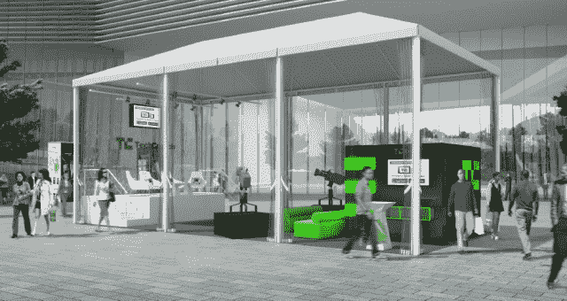

# 2013 年国际消费电子展:这将是电子产品初创公司 TechCrunch 的一年

> 原文：<https://web.archive.org/web/https://techcrunch.com/2013/01/03/ces-2013-this-will-be-the-year-of-the-gadget-startup/>

标题是“微软退出 2013 年国际消费电子展”。那是 2011 年 12 月 21 日，距离 2012 年 CES 还有短短几周，微软[刚刚投下一颗炸弹](https://web.archive.org/web/20220930103530/https://beta.techcrunch.com/2011/12/21/microsoft-bows-out-of-ces-2013-cites-marketing-transitions/):微软不会重返 CES。史蒂夫·鲍尔默的 2012 年 CES 主题演讲将是他的最后一次。很明显，消费电子领域正在发生变化。正如 Greg Kumparak 当时为 TC 写的那样， [CES 2012 是最近历史上最喧闹的展会](https://web.archive.org/web/20220930103530/https://beta.techcrunch.com/2012/01/12/ces-a-wonderful-example-of-not-knowing-when-to-stop/)。它被自己的重量压得奄奄一息。有些事情*不得不*改变。

它已经改变了。下周的 2013 年消费电子展将变得完全不同。这是小工具创业的一年。

今年的 CES 不会有微软、诺基亚、戴尔或惠普。展览前的新闻报道一直很少。对于即将推出的旗舰产品的模糊图像，还没有出现一圈抖动。传统的小工具博客并没有过多地谈论这个节目，因为它的形式有所不同。这不再是关于庞大的玩家，这种重新调整真的让我们在 TechCrunch 兴奋不已。CES 2013 可能最终会实现展会的潜力:成为前瞻性产品和电子产品的最大聚会。

值得提醒我们自己的是，CES 是一个大规模的活动。它吞噬了拉斯维加斯。展览正式在拉斯维加斯会议中心、邻近的希尔顿酒店、威尼斯人酒店和 LVCC 停车场(TC 的展位所在)举行。然而，记者招待会几乎在加沙地带的每一个度假村和酒店举行。大大小小的公司出租房屋、酒店套房和餐馆，有效地将展览扩展到整个地带。对于记者来说，这是一场后勤噩梦，这就是为什么我们开始在自己的展位上主持会议和进行采访(信息[这里](https://web.archive.org/web/20220930103530/https://beta.techcrunch.com/2012/12/11/hardware-hackers-unite-techcrunch-is-headed-to-ces-and-we-want-to-talk-to-you/)和[这里](https://web.archive.org/web/20220930103530/https://beta.techcrunch.com/2012/12/17/ces-2013-keep-up-with-the-news-with-our-live-video-feed-schedule/))。

在最近的大部分记忆中，CES 是由大玩家主导的:微软、英特尔、索尼和惠普。但是有一个转变正在发生。三星和联想现在是 CES 上的大佬。索尼停滞不前，惠普和微软因为转移重心或其他原因没有参加。但是每年，不管这些大公司做什么，消费电子展都在增长。还在成长。CEA 尚未发布官方数据，但在花费无数时间绘制 TC 的覆盖范围后，我很清楚这场秀比以往任何时候都大。为什么不呢？创办一家硬件公司从未如此容易。

去年见证了无数小工具创业公司的崛起。硬件突然又有吸引力了。得益于众筹和中国制造业带来的更简单的工作流程，钱是可以赚到的。正如前 TechCrunch 编辑 Erick Schonfeld 最近注意到的，[硬件是新的软件](https://web.archive.org/web/20220930103530/http://erickschonfeld.com/2013/01/02/hardware-is-the-new-software/)。CES 2013 不会发布大型平板电脑或最新的热门设备趋势(CES 2009 只关注上网本)。2013 年消费电子展将会是一个由小工具创业公司创造的互联未来。

今年夏天，Pebble 手表点亮了 Kickstarter，而[苹果公司也一直被传言将开发自己的智能手表](https://web.archive.org/web/20220930103530/https://beta.techcrunch.com/2012/12/27/rumor-apple-building-bluetooth-smart-watch/)。然后是 [Cookoo](https://web.archive.org/web/20220930103530/https://beta.techcrunch.com/2012/05/31/cookoo-move-over-pebble-theres-a-new-e-watch-in-town/) 、 [MetaWatch](https://web.archive.org/web/20220930103530/https://beta.techcrunch.com/2012/07/28/move-over-pebble-metawatchs-new-strata-aims-to-make-a-splash-on-kickstarter-too/) ，卡西欧的几款，以及索尼雄心勃勃但最终有缺陷的智能手表。

目前有几款智能手表模糊了联网助理和私人教练之间的界限。2012 年发布的产品，如耐克的 FuelBand 和摩托罗拉 MOTOACTV，已经涉足了这两个领域。毫无疑问，更多的初创公司和老牌公司将推出竞争模式。

在 2008 年的 TechCrunch 50 上，FitBit [向一个几乎空白的领域推出了它的第一款产品](https://web.archive.org/web/20220930103530/https://beta.techcrunch.com/2008/09/09/tc50-fitbit-fitness-gadget-the-makes-us-want-to-exercise/)。现在，在 2012 年的最后一部分，量化自我市场相当拥挤，被其他初创公司和大公司占领，如耐克和摩托罗拉。但市场本身仍然渴望更智能、更小、连接更好的设备。随着公司开始关注不仅仅是简单的运动和重量，有足够的空间给更多的玩家。

SmartThings 是 2012 年 Kickstarter 上的另一个热门产品。这家初创公司承诺“让你的东西更智能”，是引领物联网潮流的公司之一。该公司开发了一个平台，将家居用品连接到云服务。这是一个雄心勃勃的计划，但在这个互联的未来，SmartThings 并不孤单。其他公司，从大到小，都在 2012 年发布和调侃过类似的项目。

Belkin 发布了 WeMo，这是一个用于控制电源插座和简单房间监控的 iOS 解决方案。YC 校友 Lockitron 宣布了其第二代锁定系统 T1，Lumawake 开始在 Kickstarter 上为其连接的 iPhone 5 基座筹集资金。物联网刚刚开始获得牵引力，CES 2013 将有助于推动它向前发展。

这么多硬件创业公司，CES 2013 应该比其他任何展会都热闹。创业公司有进取心。他们需要大声才能被听到。三星(Samsung)和索尼(Sony)这些大公司仍将吸引大量注意力，但今年的 CES 应该会有不同的氛围。TechCrunch 很高兴能在那里大展拳脚。我们派出了比以往更多的作家、编辑和视频制作人员。

CES 不需要微软，就像微软不再需要 CES 一样。三星、索尼以及几乎松下也是如此。这些公司足够大，可以随时吸引观众，这也是苹果在 2008 年退出贸易会议的原因。但这并不意味着 CES 已死。只是在改变。从 TechCrunch 的角度来看，这变得有趣多了。

过去几年，真的没有理由参加 CES。这是一堆注定要失败的小玩意，来自那些应该更清楚的公司。大公司正在对抗一股根本不存在的力量。 [MG 是对的](https://web.archive.org/web/20220930103530/https://beta.techcrunch.com/2012/01/05/best-ces-ever/)。苹果甚至没有参加就“赢”过了 ces。今年仍然如此，尽管影响较小。小工具初创公司聪明地避开了传统，打破了陈旧的产品领域，或者推出了全新的产品领域。