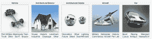

# 3D 模型在线市场 CGTrader 从 Practica  筹集了 18.5 万欧元

> 原文：<https://web.archive.org/web/https://techcrunch.com/2013/02/21/cgtrader-an-online-marketplace-for-3d-models-raises-185k-euro-from-practica/>

# 3D 模型在线市场 CGTrader 从 Practica 筹集了 18.5 万欧元

随着 3D 打印和建模成为主流，有趣的是看到市场中小企业的崛起和资本的增加。以 CGTrader 为例。它最初是为 3D 设计师和艺术家设计的市场，刚刚从立陶宛的一家基金 Practica Capital 筹集了近 20 万欧元。该公司由[马里乌斯·卡雷蒂斯](https://web.archive.org/web/20230317144738/http://lt.linkedin.com/pub/marius-kalytis/8/505/67)创立，总部位于维尔纽斯。

大多数模型都是针对视频游戏创作者和其他 3D 书呆子的高度精细的对象。然而，因为 3D 模型是 3D 模型，所以 CGTrader 能够出售几乎任何虚拟物体。

3D 模型行业的一个主要问题是众所周知的设计师和艺术家的版税低——模型的创作者经常只收到销售收入的 40 %- 60 %,或者为了赚更多，经常受到排他性要求的约束。这使得在线销售 3D 模型对设计师来说不是一项非常有吸引力的活动，因此限制了行业增长的潜力，”Kalytis 说。他说 CGTrader 是“一个公平的、对作者友好的市场”

该公司从任何销售额中抽取 6%，当客户有问题或疑问时，他们可以使用该平台来支持他们。

“这笔资金将用于从技术角度开发市场，进一步建设社区，最重要的是，为我们的设计师扩大分销渠道——包括 3D 打印，”Kalytis 说。这是马的 3D 模型的一小步，是 3D 打印作为一个整体市场的货币化的一大步。

