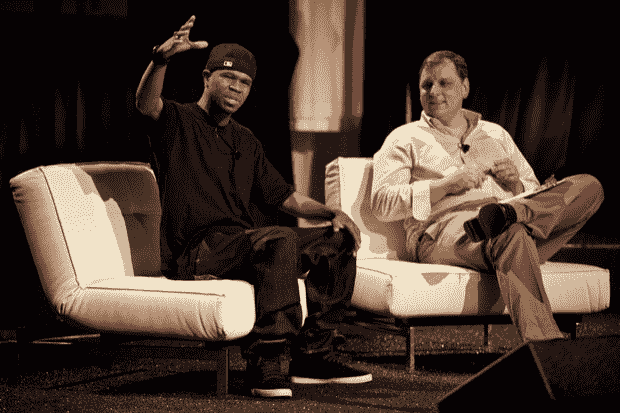
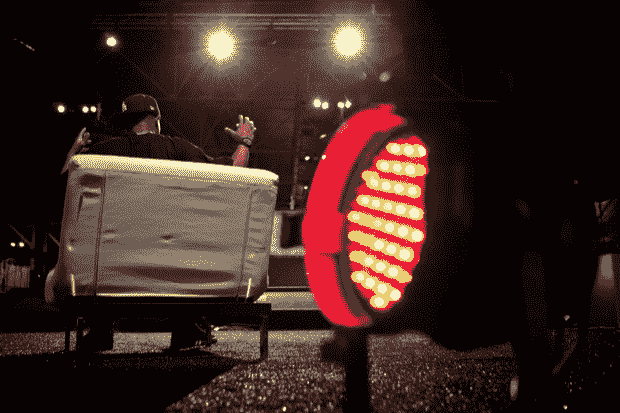

# 为什么百万富翁在这里？

> 原文：<https://web.archive.org/web/http://techcrunch.com/2010/09/28/chamillionaire-is-here/>

显然是被人盯上了

[his frequent attendance at tech conferences,](https://web.archive.org/web/20230203074724/https://techcrunch.com/2010/07/30/chamillionaire-just-wants-your-business-card/)

Chamillionaire 今天和 Mike Arrington 一起站在舞台上

[TechCrunch Disrupt](https://web.archive.org/web/20230203074724/http://disrupt.beta.techcrunch.com/2010-sf/)

大会来回答这个问题，

**“Why is Chamillionaire here?”**

Chamillionaire 在这里是因为他想让人们了解技术世界如何戏剧性地改变他的世界。Chamillionaire 在这里是因为说唱歌手知道的“最大的科技产品”是 Napster，而不是 Spotify。

*“我可以去十个我的说唱兄弟那里，他们都不知道 Spotify。Spotify 将极大地改变我的行业。”*

他在这里是因为技术进步不会渗透到艺术家身上。

Chamillionaire 在这里是因为像 Chamillionaire 这样的人是有影响力的人，他们是你的孩子在 Twitter 上关注的人。

*“有时我在音乐会上问，你们中有多少人在推特上，人群变得疯狂。然后我问起脸书，人群变得更加疯狂。”*

所以不要问为什么百万富翁在这里，我们应该问为什么说唱游戏中的其他人不在这里。亿万富翁来这里是为了知识，他来这里是为了竞争。

“一个贾斯汀比伯迷，一个 Lady Gaga 迷知道 iTunes。一个说唱乐迷不知道 iTunes，他们会去找 torrent。任何比免费更自由的东西，最终都会成为音乐。”

Chamillionaire 在这里是因为音乐产业是一个回音室，就像硅谷一样。Chamillionaire 在这里是因为他自 90 年代以来一直站在技术的最前沿。

Chamillionaire 在这里是因为还没有一半是科技企业家，一半是说唱歌手的会议。Chamillionaire 在这里是因为他厌倦了这个行业，不会通过环球唱片发行他的最新专辑。

亿万富翁在这里是因为他比马克·扎克伯格更擅长回避问题。百万富翁在这里是因为他的生意是赢。他在这里是因为如果你创业失败了，你可以再开一家。

他在这里是因为创业的世界让你无所畏惧，也能让你做傻事。

他在这里是因为有人想让他成为他们搜索引擎的“代言人”。

*“我打赌是布雷克，我希望不是库伊尔”*

百万富翁来这里是因为他想认识像罗恩·康韦这样的大佬。他在这里是因为他知道如果一个初创公司没有用户基础，你就不应该投资 2 美元。

他在这里，因为这里应该有更多他那个世界的人。

