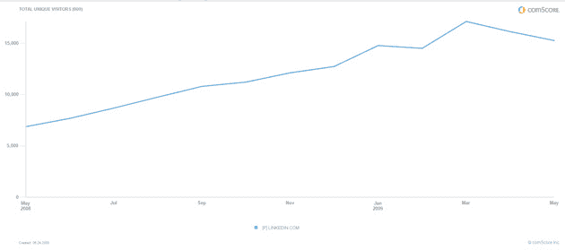
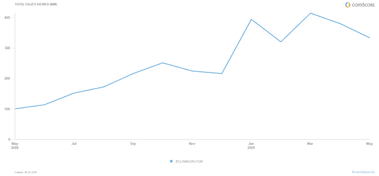

# 卫兵换岗:杰夫·韦纳在 LinkedIn-TechCrunch 担任首席执行官

> 原文：<https://web.archive.org/web/https://techcrunch.com/2009/06/24/changing-of-the-guard-jeff-weiner-takes-ceo-spot-at-linkedin/>

去年 12 月 LinkedIn 进行了一次管理层改组——首席执行官[丹·奈](https://web.archive.org/web/20220704061050/http://www.crunchbase.com/person/dan-nye)辞职。创始 CEO [雷德·霍夫曼](https://web.archive.org/web/20220704061050/http://www.crunchbase.com/person/reid-hoffman)再次介入，前雅虎高管[杰夫·韦纳](https://web.archive.org/web/20220704061050/http://www.crunchbase.com/person/jeff-weiner)加入公司担任总裁。

聘请韦纳担任总裁显然是一个临时举措，我们预测他将在今年的某个时候担任首席执行官的角色:*“韦纳的加入也很奇怪，也许可以解释这些变化。韦纳可能期待他的下一份工作是担任首席执行官。他现在仅次于霍夫曼。或许该公司正在利用这一过渡期，看看他如何处理自己领导公司的问题。如果韦纳在 2009 年接受 LinkedIn 的首席执行官一职，或者离开公司，我不会感到惊讶。*事实证明，事情正是如此。

LinkedIn 继续滚动。根据我们最近的模型，他们是第五大最有价值的社交网络。该网站每月吸引超过 1500 万独立访问者(康姆斯克全球，2009 年 4 月)，而一年前不到 700 万，并有 4200 万注册个人资料。自去年以来，他们已经实现了 ebitda 盈利，并表示他们计划今年实现正现金流。二月份，[霍夫曼告诉我](https://web.archive.org/web/20220704061050/http://www.beta.techcrunch.com/2009/02/02/linkedins-reid-hoffman-we-can-go-public-any-time-we-want-to/) *“我们可以在任何我们想上市的时候上市。”*

韦纳对此表示同意，他今天告诉我，他们目前的计划是建立一家独立的上市公司，有三个主要收入来源:付费订阅、企业解决方案和广告。迄今为止，该公司已经筹集了 1 亿多美元。在一年前的最后一轮融资中，该公司的估值刚刚超过 10 亿美元。

霍夫曼将留在公司，成为执行董事长。他表示，这是一个全职的高管职位，而不仅仅是一个董事会席位。就韦纳而言，他已经管理了公司的日常运营。霍夫曼说，他“在领导公司方面做得非常出色。”

就在一年前，我们披露了韦纳离开陷入困境的雅虎的消息。韦纳最初加入雅虎是在前首席执行官特里·塞梅尔(Terry Semel)于 2000 年上任时，他是离职时的高管之一，负责网络部门(包括雅虎的主页、邮件、搜索和媒体资产)。前雅虎总裁[苏·德克尔](https://web.archive.org/web/20220704061050/http://www.crunchbase.com/person/susan-decker)在他辞职时给了他一个[般的欢送](https://web.archive.org/web/20220704061050/http://www.beta.techcrunch.com/2008/06/16/sue-deckers-email-to-yahoo-employees-on-weiners-departure/)。在加入 LinkedIn 之前，韦纳是 Accel Partners 和 Greylock Partners 的 EIR。

以下是完整的新闻稿:

LinkedIn 任命杰夫·韦纳为首席执行官
联合创始人雷德·霍夫曼继续担任执行主席

加利福尼亚州山景城——2009 年 6 月 24 日——全球最大的职业社交网络 LinkedIn 今天宣布，杰夫·韦纳(Jeff Weiner)被任命为 LinkedIn 首席执行官，并进入董事会。雷德·霍夫曼将继续专注于 LinkedIn 的日常工作，担任创始人兼执行董事长。

自 2009 年 1 月加入 LinkedIn 担任临时总裁以来，Weiner 监督了所有运营，并在制定和执行公司战略以满足全球对 LinkedIn 产品和服务日益增长的需求方面发挥了决定性作用。“过去六个月与里德和团队的密切合作超出了我对公司的所有期望，”韦纳说。“我对我们迄今取得的进展和摆在我们面前的机遇感到无比兴奋。”

LinkedIn 的联合创始人兼执行主席雷德·霍夫曼表示:“LinkedIn 的成立是为了利用互联网的力量，创造一种工具，帮助个人成为更有效、更成功的专业人士。”。“在过去的六个月里，Jeff 在领导公司方面做得非常出色，我期待着继续我们已经开始的工作。”

在过去的一年里，LinkedIn 在几乎所有关键的运营和财务指标上都创下了记录，最近全球会员超过了 4200 万。LinkedIn 有一个既定的商业模式，有三条收入线，包括高级订阅、企业解决方案和广告。该公司 2008 年运营盈利，预计 2009 年盈利。LinkedIn 已经从一些世界顶级投资者那里获得了超过 1 亿美元的资金。

韦纳带来了超过 14 年的消费者网络经验的立场。在加入 LinkedIn 担任临时总裁之前，Weiner 曾在 Accel Partners 和 Greylock Partners 担任常驻高管。他之前在雅虎担任过重要的领导职务。，最近担任雅虎的执行副总裁。负责雅虎的美国网络部门！美国消费者网络产品组合，包括雅虎！的首页、邮件、搜索和媒体产品。除了 LinkedIn，Weiner 还在 DonorsChoose.org 和疟疾不再是董事会任职。更多信息，请访问杰夫·韦纳的 LinkedIn 个人资料:http://www.linkedin.com/in/jeffweiner08.

关于 LinkedIn
LinkedIn 让你的个人商业网络在线化，让你接触到前所未有的人、工作和机会。LinkedIn 建立在可信的联系和关系之上，已经建立了世界上最大、最强大的职业网络。目前，LinkedIn 上有超过 4200 万名专业人士，代表了财富 500 强中的所有 500 家公司，以及技术、金融服务、媒体、包装消费品、娱乐、时尚和众多其他行业中的众多知名人士。LinkedIn 得到了世界级投资者的支持，包括红杉资本、Greylock Partners、欧洲创始人基金、Bessemer Venture Partners、贝恩资本风险投资、高盛、麦格劳-希尔公司和 SAP Ventures。

