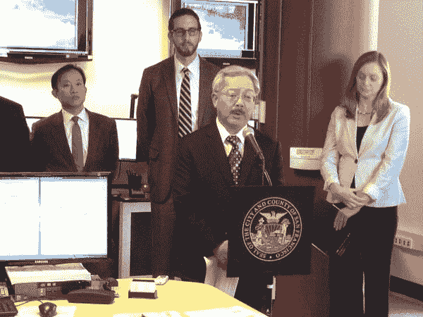

# 李市长计划向使用旧金山公交车站的科技公司收取每年约 10 万美元的费用

> 原文：<https://web.archive.org/web/https://techcrunch.com/2014/01/06/charging-tech-shuttles-for-muni-bus-stops/>

# 李市长计划向使用旧金山公交车站的科技公司收取每年 10 万美元的费用

旧金山市长李爱德刚刚提议向那些通勤班车停靠在市政公共汽车站的科技公司收费。该计划在今天的新闻发布会上公布，要求航天飞机必须有许可证，为最初 18 个月的试点项目提供资金。根据来自[莎拉·G·麦克布赖德](https://web.archive.org/web/20221218041906/https://twitter.com/mcbridesg/status/420302834081353728)和[克朗 4 公司的丹·科曼](https://web.archive.org/web/20221218041906/https://twitter.com/DanKermanSF)的推文，每家公司每年的许可费用大约为 10 万美元

旧金山市政运输局仍需在 1 月 21 日的会议上批准该计划，然后才能付诸实施。谷歌、苹果、基因泰克和脸书的代表与李市长一起出现在新闻发布会上。

像鲍尔公司这样的穿梭公司和雇佣他们的科技巨头将被收取每日每城市停车费。科曼报告说，这个试点项目可以产生 150 万美元的收入，这意味着 10 到 15 家公司可以为他们的航天飞机付费。该计划将使来自没有许可证的公司的班车使用市政站成为非法。

更新:以下是市长李爱德关于该项目的新闻稿全文:

[scribd id = 196709848 key = key-1 zwbcac 7 mysg 0 xvn 6 ok 6 mode = scroll]

李开复的计划可能会缓解人们对科技公司的紧张情绪，这些公司会提供通勤班车，让员工更容易在这座城市生活。上个月，抗议者拦住了谷歌和苹果的班车，其中一辆的窗户被打破。

虽然李的计划可能是一个良好的开端，但一些抗议活动的组织者呼吁科技公司支付 10 亿美元，以使用市政站，直到现在——这个数字是基于如果该市执法，他们会收到的罚款。

上个月，旧金山交通局表示，私人通勤班车使用大约 200 个旧金山市政公交站来运送 35，000 名员工往返于旧金山和谷歌、脸书、苹果和基因泰克等公司之间。一些人认为这是不可接受的私人使用公共基础设施，可能会延误市政公共汽车和乘客。

通过向公司收费，旧金山可以将赚来的钱用于改善公私共享的基础设施，改善城市内的公共交通，或资助其他减轻中产阶级化影响的项目。

*【图片:[@ rev script](https://web.archive.org/web/20221218041906/https://twitter.com/revscript/status/414059193520635904)*