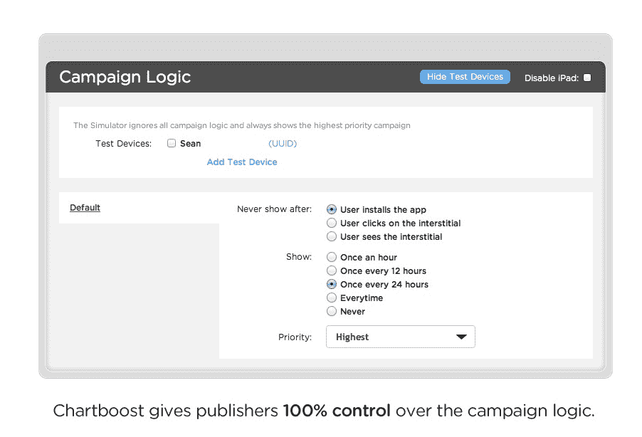

# Chartboost 为手机游戏发行商推出新的直接交易市场 

> 原文：<https://web.archive.org/web/http://techcrunch.com/2011/10/03/chartboost-launches-new-direct-deal-marketplace-for-mobile-game-publishers/>

新的直接交易广告市场 Chartboost 今天推出，允许手机游戏开发商使用交叉推广技术来增加游戏用户群的规模，从而增加收入。该公司由前 Tapulous 员工 Maria Alegre(现任 Chartboost 首席执行官)和首席技术官 Sean Fannan 创建。

在[迪士尼收购 Tapulous](https://web.archive.org/web/20230204193318/https://techcrunch.com/2010/07/01/tapulous-acquired-by-disney/) 后，Chartboost 的创始人决定帮助建立一个平台，让其他游戏发行商拥有同样的能力，以最大限度地提高他们的发行能力，这是他们认为 Tapulous 最有价值的资产。

之前，Alegre 在 Tapulous 公司做业务和收入助理。她后来成为迪士尼旗下 Tapulous Labs 工作室的负责人，负责货币化和推出战略、项目管理和游戏设计。Fannan 是 Tapulous 的高级软件工程师，在那里他构建并管理原始的服务器架构，帮助扩展并协调与微软、Groupon、迪士尼和福克斯等品牌的营销交易工程。

[Chartboost](https://web.archive.org/web/20230204193318/http://www.chartboost.com/) 不是一个广告网络，该公司解释说，它是一个技术平台。它通过 Chartboost [SDK](https://web.archive.org/web/20230204193318/http://www.chartboost.com/support/sdk) 为直接交易和交叉促销提供免费的广告服务技术。Chartboost 出版商从这些交易中获得 100%的收入分成，而不是通过广告网络进行直接交易。

该平台包括贴有白色标签的全屏间隙，出版商可以用它来推广他们的其他图书。当它们不在内部使用时，这些空间可以直接出售给其他出版商，用于创收。Chartboost 还说，因为中间用户在推广推荐的游戏，他们不会被最终用户当成广告来看待。

Chartboost 还提供了深入的指标，允许出版商跟踪直接交易和交叉促销，并相应地管理他们的库存。这些分析显示了每个应用程序的展示次数、点击次数、安装次数、每次点击费用、消费者价格指数和 eCPM。跟踪 UDIDs 的 API 也是可用的。

该公司目前以免费增值模式运营:广告服务器技术在用于直接交易或内部交叉推广时是免费的。与此同时，[选择加入广告网络](https://web.archive.org/web/20230204193318/http://www.chartboost.com/web/pricing-and-faq)与出版商分享收入，允许他们最大限度地利用未售出的库存，这些库存没有在内部用于交叉推广或直接交易。这些活动使用每次点击成本(CPC)或每次安装成本(CPI)等指标来确定价格。

在发布时，著名的 Chartboost 发行商包括 TinyCo、Storm8、Pocket Gems、Gameview Studios、The Playforge、Funzio、OMGPOP、Com2us、Fluik Entertainment、Sunstorm Interactive、Ace Viral、Camigo Media、Neon Play、Lakoo 和 Devsisters。其中几家是各自市场的领先发行商，许多是排名前 100 的应用程序制造商。

截至 8 月 31 日，自筹资金的 Chartboost 表示，它是一家盈利的公司。

该平台目前在 iOS 平台上运行，并将很快在 Android 平台上推出。