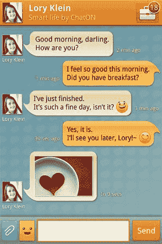

# 三星版 iMessage ChatON 登陆安卓市场 

> 原文：<https://web.archive.org/web/http://techcrunch.com/2011/10/14/chaton-samsungs-version-of-imessage-arrives-in-android-market/>

# 三星版 iMessage ChatON 登陆安卓市场

三星的跨平台消息应用 ChatON 今天早上已经登陆谷歌安卓市场。这项服务，[在八月](https://web.archive.org/web/20230204222616/https://techcrunch.com/2011/08/29/samsung-to-launch-chaton-for-cross-platform-mobile-chat-service/)宣布，类似于 RIM 的黑莓 BBM 或苹果的 iMessage，它允许短信或彩信的替代。

目前，ChatON 支持 Android、bada 和三星功能手机，但该公司承诺很快将支持 iOS 和黑莓。

除了手机聊天之外，ChatON 还计划提供一个基于网络的客户端，用户也可以通过电脑聊天。用户可以进行一对一的私人对话，参与群聊并共享媒体，如照片、视频、语音消息和联系人。

在三星的功能手机上，该服务允许文本、图像、日历约会和联系人共享。在智能手机上，用户将有一些额外的选择，例如评论彼此的个人资料，发送结合文本和音频的多媒体消息，以及查看自己的“互动排名”，该排名显示他们在 ChatOn 网络上的活跃程度。

Android Market 的描述还增加了一些关于发送“动画”消息的内容，这些消息是通过绘图创建的。

安卓版本在[安卓市场](https://web.archive.org/web/20230204222616/https://market.android.com/details?id=com.sec.chaton)有售。它可以在 Android 2.2 和 2.3 上运行。三星(bada，功能手机)版本在[三星应用商店](https://web.archive.org/web/20230204222616/http://samsungapps.com/topApps/topAppsDetail.as?categoryId=0000009883&productId=G00001609202)有售。(请注意，这并非在所有市场都可用)。

*帽子提示:[三星 Hub](https://web.archive.org/web/20230204222616/http://sammyhub.com/2011/10/14/samsung-chaton-now-available-for-android)*

