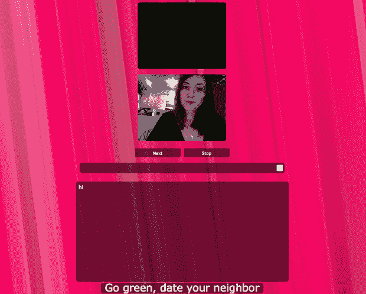
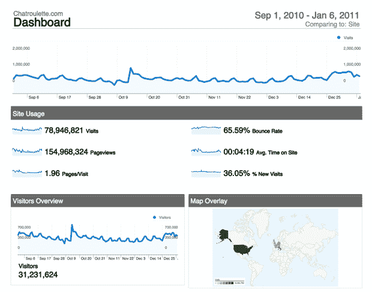

# 聊天轮盘获得了一个新的，奇怪的改造

> 原文：<https://web.archive.org/web/https://techcrunch.com/2011/01/03/chatroulette-facelift/>

# 聊天轮盘得到了一个新的，奇怪的改造

在[长时间的宕机没有导致任何明显的改善之后，被遗忘了几个月的](https://web.archive.org/web/20230307105439/https://techcrunch.com/2010/08/24/launch-tease/)，每个人都喜欢的视频聊天网站 [Chatroulette](https://web.archive.org/web/20230307105439/http://www.chatroulette.com/) 提出了以下解决其用户下降问题的方法:皮肤！

在关注了一条来自 [@Chatroulette](https://web.archive.org/web/20230307105439/http://twitter.com/chatroulette) Twitter 账户的神秘推文之后( *[" **chatroulette** 又回来了！一张新面孔**聊天轮盘**。在一个兔子洞里，我发现你现在可以在聊天的时候改变你在 Chatroulette 上的背景。在我短暂的尝试中，我已经看到了一切，从希腊神话主题到彩虹超色到旭日到佩斯利到我们上面的热粉色。](https://web.archive.org/web/20230307105439/http://twitter.com/#!/chatroulette/status/22118248006819840)*

不幸的是，聊天的视频部分目前在我自己的电脑上似乎无法工作，我不得不切换电脑来获得上述屏幕截图。大约在我第五次尝试的时候，我被要求参加一项用户调查，这可能会也可能不会给我赢得一台免费的 iPad。网站底部还有一个奇怪的链接“绿色环保，和你的邻居约会”,链接指向 Singles-roulette.com。我没有进一步冒险。

我已经给聊天轮盘创始人[安德烈·特诺夫斯基](https://web.archive.org/web/20230307105439/http://www.crunchbase.com/person/andrey-ternovskiy)发了电子邮件，看看他是否有任何计划，除了界面刷新和受捕兽者启发的图形，以对抗[滞后的网站流量](https://web.archive.org/web/20230307105439/http://trends.google.com/websites?q=chatroulette.com&geo=all&date=all&sort=0)，如果/当他回复我时，我会更新这个帖子。

从更积极的方面来说，我还没有看到任何 NSFW 的东西。也许皮肤终于起作用了？

**更新**:越来越奇怪了。Ternovskiy 刚刚发邮件告诉我， [@Chatroulette](https://web.archive.org/web/20230307105439/http://twitter.com/Chatroulette.com) 不是官方 Twitter 账户，尽管谷歌趋势显示，网站流量自 10 月以来一直在上升。该公司原本不打算公布的 Skinsroulette 功能在几天前开始实施。下面是他自己的内部谷歌分析仪表板显示的内容。

