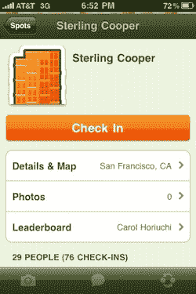

# 签到疲劳。或者，为什么我支持一场全面的定位战。

> 原文：<https://web.archive.org/web/https://techcrunch.com/2010/03/19/check-in-fatigue-location-war/>

在今年的 SXSW 上，我没有遇到一些人遇到的[问题](https://web.archive.org/web/20230316161016/http://blogs.sfweekly.com/shookdown/2010/03/sxswi_is_dead.php)。在某些比赛项目中，T4 是不是太拥挤了？当然可以。但是有很多可供选择的事情要做。一些[主题演讲是否轰炸了](https://web.archive.org/web/20230316161016/https://techcrunch.com/2010/03/15/sxsw-keynote-ev-williams-umair-haque/)？是的。但是还有很多其他的东西可以听。AT & T 失败了吗？不。事实上，他们在维护网络方面做得很棒。相反，我遇到了另一种问题:报到疲劳。

鉴于 [location 是今年 SXSW](https://web.archive.org/web/20230316161016/https://techcrunch.com/2010/02/25/location-sxsw/) 的 Twitter，鉴于我写了很多关于 location 的东西，我想在实际的会议中尽可能多地使用这些服务。我大大低估了实际工作量。

起初，当我到达奥斯汀的一个地方时，我使用手机上的所有服务进行登记。这其中包括:[四方](https://web.archive.org/web/20230316161016/http://foursquare.com/)、 [Gowalla](https://web.archive.org/web/20230316161016/http://gowalla.com/) 、 [Loopt](https://web.archive.org/web/20230316161016/http://loopt.com/) 、 [Whrrl](https://web.archive.org/web/20230316161016/http://whrrl.com/) 、 [Brightkite](https://web.archive.org/web/20230316161016/http://brightkite.com/) 、 [Burbn](https://web.archive.org/web/20230316161016/http://burbn.com/) 、 [MyTown](https://web.archive.org/web/20230316161016/http://booyah.com/) 、 [CauseWorld](https://web.archive.org/web/20230316161016/http://causeworld.com/) 、 [Hot Potato](https://web.archive.org/web/20230316161016/http://hotpotato.com/) 、 [Plancast](https://web.archive.org/web/20230316161016/http://plancast.com/) 、 [Foodspotting](https://web.archive.org/web/20230316161016/http://foodspotting.com/) 。即使有很好的 AT & T 服务，也要花整整 10 分钟或更长时间才能为所有人办理登机手续。当我不得不停下来向我的朋友解释我一直在手机上到底在做什么的时候，我花了更长的时间。

这是我们停留的每一个场地。这种情况根本站不住脚。

到第二天，我已经把我要登记的服务减少了一半。这仍然不是我会考虑经常做的事情。在奥斯汀的最后一段时间里，我只使用了两种服务——是的，在“战争”中的两种服务——four square 和 Gowalla。

我在奥斯汀认识的几乎所有人都在使用 Foursquare 和 Gowalla 发送他们所有的签到信息。所有人似乎都同意:仅仅使用两个服务来做同样的事情还是太单调乏味了。最后应该只有一个。

因此，一些公司已经着手解决这一问题也就不足为奇了。一个是 Brightkite 的创造者，他们设法获得了杀手 [check.in](https://web.archive.org/web/20230316161016/http://check.in/) 域名。一天晚上，该团队在一个聚会上向我展示了这款应用的预览版，我立刻就知道这正是我所需要的(见这里的预览版)。

另外, [LocationFu](https://web.archive.org/web/20230316161016/http://www.locationfu.com/) 是另一个(基于网络的)应用，可以让你同时在 Foursquare、Brightkite、Fire Eagle 和 Twitter 上签到。

但是这些解决方案也有一个问题。目前，Gowalla 的 API 是只读的，这意味着你实际上不能使用另一个应用程序来签到服务。就在 SXSW 之前，我和 CEO 乔希·威廉姆斯谈了一下这个问题，他指出这背后的主要想法是保持 Gowalla 正在寻找的用户体验(这是一个非常像苹果的论点)。但是，他确实说过，最终他认为他们会开放一个双向 API——也许一旦他们有时间创建一些最佳实践文档，他指出。

另一个问题是，目前这些登记服务中的每一个都有它们自己的地点数据库。这意味着 Foursquare 上的一个地方可能与 Gowalla 上的一个地方略有不同，尽管它们在技术上是同一个地方。更糟糕的是，有些场馆有很多复制品，因为人们可以创建自己的场馆。Check.in 通过查找每项服务并让您选择正确的登记地点来解决这个地点问题。但是它有点慢，而且看起来还是很乏味。

一个更好的解决方案是各种服务采用一个场所标准。[活动流](https://web.archive.org/web/20230316161016/http://activitystrea.ms/)小组[正在研究](https://web.archive.org/web/20230316161016/http://groups.google.com/group/activity-streams/browse_thread/thread/366eeb21cfe72fe9?hl=en)这样一个概念。雅虎也可以在 WOEID 系统的基础上实现这样一个系统。当然，任何采用这种标准的服务都将冒至少部分业务风险，因为这些位置数据库是每个服务的关键之一。

与此同时，脸书正在考虑从 Foursquare 和 Gowalla 收集数据，用于自己即将到来的位置实现。这可能是统治他们所有人的一个地点吗(当然，写回 Gowalla 仍然可能是一个问题)？如果推特上有[关于这件事的任何言论](https://web.archive.org/web/20230316161016/https://techcrunch.com/2010/03/09/twitter-location-website/)就不会了。

我喜欢[现在所有这些创业公司都在](https://web.archive.org/web/20230316161016/https://techcrunch.com/2010/03/19/location-gold-rush/)周围涌现(自从我从 SXSW 回来后，至少有十几个给我发了电子邮件)。但我开始担心这将变成社交战争的重演，我们都有 15 个不同的个人资料，我们必须在一系列网络中不断更新。

在我们去年的实时会议上，我在[我们的现场](https://web.archive.org/web/20230316161016/https://techcrunch.com/2009/11/20/realtime-crunchup-the-rise-of-geo-streams/)小组会议上提出了这个问题。舞台上的所有玩家(包括 Twitter、Foursquare、Hot Potato、Google Latitude、GeoAPI 和 SimpleGeo)似乎都想说，他们可以友好相处，共同努力，从整体上改善地理位置。当时没买，现在肯定也不买。

从商业的角度来看，让这些人彼此友好相处，让你不必使用他们的服务是没有意义的。需要采取步骤*确保*您将[使用他们的服务](https://web.archive.org/web/20230316161016/https://techcrunch.com/2009/12/23/location-2010/)，并且将这样做而不是竞争对手的服务。这就是它的工作方式，也是它一直以来的工作方式。这就是为什么这是一场战争。目前，这只是早期阶段，各方都在武装自己。很快，他们会试图杀死对方。这也许不是一件坏事。

*【图片:Flickr/***】**