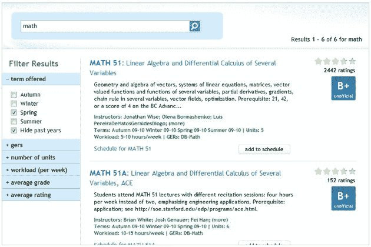

# Chegg 的第一笔收购:course rank 

> 原文：<https://web.archive.org/web/https://techcrunch.com/2010/08/18/cheggs-first-acquisition-courserank/>

# Chegg 的第一笔收购:CourseRank

[Chegg 的](https://web.archive.org/web/20230121205737/http://www.chegg.com/)教科书租赁业务继续疯狂增长——例如，我们[估计](https://web.archive.org/web/20230121205737/https://techcrunch.com/2010/06/05/teardown-chegg/) 2010 年的收入为 1.3 亿美元。该公司现在开始收购与其核心业务互补的业务。首先是由三名斯坦福学生于 2007 年创立的 CourseRank。Chegg 说，CourseRank 筹集的资金总额为 0 美元，这是“迄今为止资助的激浪”。

该公司表示，CourseRank 帮助学生选择课程，95%的斯坦福学生都在使用它。加州大学伯克利分校、杜克大学、康奈尔大学以及美国和加拿大的其他大学和学院现在也在使用它。该公司现在有五名员工。

来自 CourseRank 网站:

> CourseRank 是一个网站，旨在简化为每个学生选择正确课程的过程，并帮助学生利用大学提供的各种机会。该网站是专门为每所大学量身定制的，为学生提供了帮助他们规划学术生涯所需的所有信息。该网站提供的功能包括:学生课程评级和评论，帮助组织你的学术生涯和成绩的计划器，你可以与朋友分享的每周课程时间表，以及供你查找下学期书籍的地方！

自 2007 年以来，Chegg 已经筹集了 1 . 44 亿美元的风险和债务资本，并于今年早些时候聘请前雅虎首席运营官的 Dan Rosensweig 担任首席执行官。

]