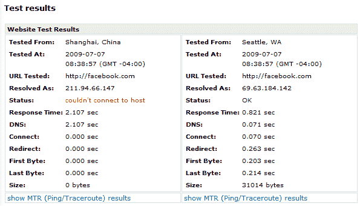

# 骚乱后，中国屏蔽了推特，脸书

> 原文：<https://web.archive.org/web/https://techcrunch.com/2009/07/07/china-blocks-access-to-twitter-facebook-after-riots/>

# 骚乱后，中国屏蔽了脸书的推特

继上周末西部地区新疆[发生](https://web.archive.org/web/20230404053516/http://abcnews.go.com/International/comments?type=story&id=8010018)致命骚乱后，中国中央政府采取了一切常规措施阻止公民访问外国网络服务:除了全面瘫痪互联网服务外，当局还屏蔽了推特，删除了搜索引擎中未经批准的暴力内容，现在显然已经采取措施[禁止公民从 Mainland China 大部分地区访问脸书](https://web.archive.org/web/20230404053516/http://www.web2asia.com/2009/07/07/first-twitter-now-facebook-banned-in-china//)。两周前，政府已经屏蔽了谷歌的几乎所有服务，包括 Gmail、Google Apps 和 Google Talk 等通讯工具。

Web2Asia 的乔治·戈杜拉写道:

> “从中国时间今天晚上 8 点开始，中国大陆的大部分地区似乎都无法进入脸书了。在我们上海办公室的中国电信连接上，服务在下午 7:45 左右消失。香港的朋友反映，他们仍然可以访问该网站。”

在 [WebsitePulse](https://web.archive.org/web/20230404053516/http://www.websitepulse.com/help/testtools.china-test.html) 上的一个快速测试证实了 Twitter 和 YouTube(这两个网站已经被限制了一段时间)被屏蔽，现在脸书也被屏蔽了，至少在这个国家的一些地方。

