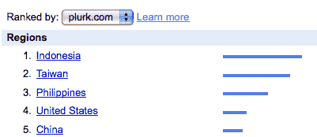
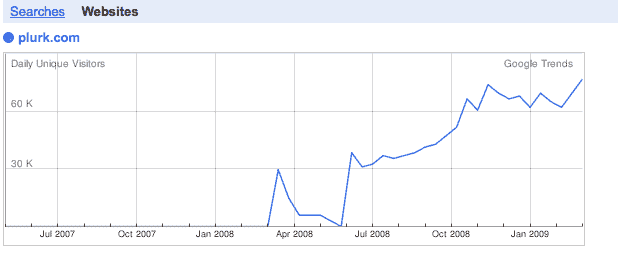
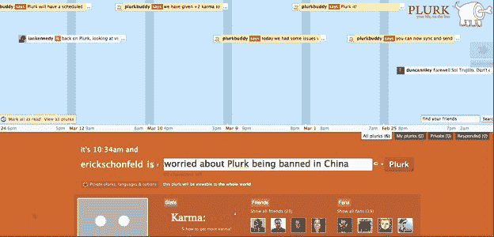

# 中国屏蔽微信息网站 Plurk。Twitter 是下一个吗？

> 原文：<https://web.archive.org/web/https://techcrunch.com/2009/04/23/china-blocks-micro-messaging-site-plurk-is-twitter-next/>

# 中国屏蔽微信息网站 Plurk。Twitter 是下一个吗？

随着微信息在海外的传播，审查的威胁在世界的某些地方隐现。昨天 [Plurk](https://web.archive.org/web/20230120081849/http://www.plurk.com/) ，一个与 Twitter 竞争的微信息服务，发现它在中国被[屏蔽了。根据 Plurk 的首席开发者 Amir Salihefendic 的说法，“我们 Plurk 仍然不知道为什么我们被禁止，我们没有得到中国政府的任何警告，也没有与他们联系过。”但是一个快速的测试](https://web.archive.org/web/20230120081849/http://amix.dk/blog/viewEntry/19436)[证实了这个网站在中国是不可用的。](https://web.archive.org/web/20230120081849/http://www.websitepulse.com/help/testtools.china-test.html)

Plurk 是一个微消息网站，每条消息都出现在时间线上。它从未像 Twitter 那样真正流行起来，但它确实拥有一批忠实的核心追随者，并显示出一些非常早期的增长。不过，Plurk 似乎在亚洲引起了共鸣。在这方面，它就像是微消息服务的 Friendster。根据[谷歌网站趋势](https://web.archive.org/web/20230120081849/http://trends.google.com/websites?q=plurk.com&geo=all&date=all&sort=0)，Plurk 流量来源的前五个国家依次是印度尼西亚、台湾、菲律宾、美国和中国。中国排名第五。Salihefendic 表示，Plurk 在中国拥有“数万”活跃用户和“数十万”独立访客，“所以这对我们来说是一个大问题。”

因此，即使你从未听说过 Plurk，中国当局似乎也听说过，他们不喜欢他们所看到的。这是一个孤立的事件，还是这也是中国政府为 Twitter 准备的？

