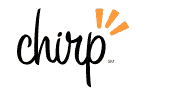

# Chirp 在测试版 TechCrunch 中推出其社交屏保

> 原文：<https://web.archive.org/web/https://techcrunch.com/2008/01/24/chirp-launches-its-social-screen-saver-in-beta/>

# Chirp 推出了它的社交屏保测试版

 今日，正在公测中上线。Chirp 是一个屏幕保护程序，之前在这里讨论过，它可以让你将来自 Flickr 和脸书的社交信息放到你的桌面上。以后还会增加其他社交网站。“我们的目的是使您能够与您的朋友保持同步，而无需登录多个网站的麻烦，”首席执行官 Eve Phillips 说。

Chirp 可以让你订阅朋友的照片，这样它就可以装饰你的屏幕。点击一张照片，Chirp 将带你到相应的 Flickr 页面，了解更多信息。这让我想起了 [Slide Desktop](https://web.archive.org/web/20230216055026/http://www.slide.com/client_helper) 应用程序，只不过它从其他网站引入了照片和数据。它基本上在浏览器之外引入了社交小工具，我们在谷歌、微软和雅虎的桌面应用中也看到了这一点。例如，Windows Vista 中的[侧边栏可以让你将各种各样的小工具放到桌面上，包括在线相册。](https://web.archive.org/web/20230216055026/http://www.microsoft.com/windows/products/windowsvista/features/details/sidebargadgets.mspx)

不过，也许我错过了一些东西，因为种子期有一些精明的投资。格雷洛克合伙公司(Greylock Partners)、杰夫克拉维尔的软科技风投和天使投资人雷德·霍夫曼(LinkedIn 董事长兼创始人)、杰伊阿德尔森(Digg 首席执行官)、戴夫萨缪尔(Spinner.com 和 Grouper 创始人)。首席技术官大卫比尔以前是 Spinner 的。我猜 Chirp 专注于将社交订阅变成一个屏幕保护程序可能会比一堆桌面小工具更具大众吸引力。

Phillips 用以下方式解释了 Chirpscreen 和 widgets 之间的区别:

> 我们旨在接管您的屏幕，将您的
> 电脑变成您选择的社交内容的显示屏，
> 自动更新来自您的朋友——您的朋友频道的内容。
> 
> 退一步讲，如果把我们做的事情分成三个领域:
> 内容聚合；过滤；和显示，大多数桌面
> 小部件聚集在一起，然后进行有限的显示。我们关注的是
> 具有高度相关的过滤和真正吸引人的、互动的
> 内容显示，而不是
> 设计成你桌面活动(浏览、
> 电子邮件等)的伴侣的桌面小工具。).

读者怎么看？请试用测试版，并在评论中告诉我。