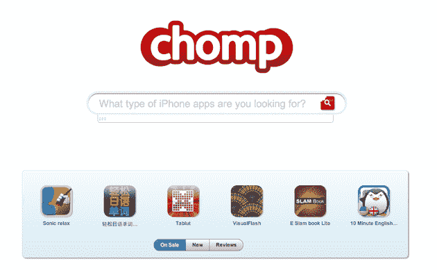
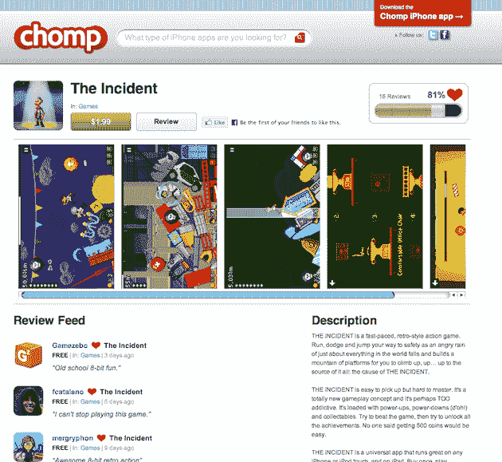

# Chomp 更深入地进行搜索；想成为应用程序的谷歌 

> 原文：<https://web.archive.org/web/https://techcrunch.com/2010/08/23/chomp-app-search/>

去年 11 月，我们第一次听说了 T2，这是一种 iPhone 应用程序的 Yelp。当时，它仍然处于隐形模式，但我们不断听到他们[以惊人的速度从罗恩·康韦等投资者那里筹集了种子资金](https://web.archive.org/web/20230127142259/https://techcrunch.com/2009/11/06/chomp-eats-up-some-seed-funding-next-will-bite-into-the-mobile-space/)。显然，我们很感兴趣。

到了一月份，我们在实际服务中有了一个[潜行高峰](https://web.archive.org/web/20230127142259/https://techcrunch.com/2010/01/06/chomp/)。而大约一周后，它[正式推出](https://web.archive.org/web/20230127142259/https://techcrunch.com/2010/01/11/chomp-iphone-recommendations/)作为苹果应用商店的应用推荐引擎。另一轮更大的融资很快就来了，从那时起，Chomp 已经有了超过 40 万的活跃用户。但是现在是时候让事情更上一层楼了——通过搜索。

App Store 里的应用发现基本上还是很烂的。这是苹果策划的主页(做得很好)。但除此之外，这几乎是一场噩梦。Discovery 不断受到开发者的攻击，他们试图通过在标题中添加虚假词语来欺骗系统。现在有超过 250，000 个 iPhone 应用程序，只需要有一个更好的方法来找到最好的。

当然，Chomp 一直是这么做的。但到目前为止，他们基本上只是根据你在 Chomp 上的社交图来做推荐。是的，有一些基本的搜索功能，但它并不比苹果公司提供的更好(同样，相当糟糕)。今天，全新的应用搜索引擎发布了。值得注意的是，它同时出现在 Chomp 应用程序和 chomp.com 上。

联合创始人[本·基格兰](https://web.archive.org/web/20230127142259/http://www.crunchbase.com/person/benjamin-keighran)称这个最新版本的 Chomp“*是搜索和浏览应用*最个性化的方式他指出，增加基于主题的搜索将改变人们发现应用的方式。“*想象一下，你必须去谷歌搜索‘www . Facebook . com’——而不是仅仅搜索‘社交网络’，然后脸书出现在搜索结果中*，”这是他的说法。

像 [Appsfire](https://web.archive.org/web/20230127142259/http://appsfire.com/) 这样的竞争对手也在做搜索，但他们也主要是基于标题(和描述)的。在 Keighran 看来，这还不够。

他指出，以前不仅仅是简单的姓名搜索，搜索结果会根据应用程序的受欢迎程度显示出来。虽然这不是最糟糕的方式，但 Keighran 认为用户已经在 Chomp 中播种的 5000 万条推荐将提供一种更好的方式。Keighran 指出:“我们有大量的数据来构建一个语义搜索引擎。"*我们有自己的 Chomp 用户情绪。*

他还指出，在许多情况下，他们的评论比苹果自己的应用程序还多。原因是 Chomp 使得评论变得非常容易——你可以说你是讨厌这个应用还是喜欢它。如果你愿意，你可以留下 60 个字的评论。

Keighran 还表示，Chomp 的系统比苹果自己的 Genius 应用程序功能要好，因为它只是基于你已经下载的内容。这是关于你足够信任并添加到你的社交图中的人已经下载并喜爱的内容。

所有这些都指向 Chomp 更大的目标:成为人们无论在什么平台上都能找到最好应用的地方。目前，Chomp 仅适用于原生 iPhone 应用程序和 iPhone 的网络应用程序，但 Android 和 iPad 应用程序搜索/推荐正在开发中。

Keighran 看到了一个应用无处不在的未来，人们需要一个单一的地方来找到最好的应用。是的，有点像网络上的谷歌。他说:“这就像 1996 年的网络。如果这一未来得以实现，他预计到明年年底，Chomp 将拥有 1000 万用户。一个崇高的目标，但也许不是疯狂的。

如果他们能达到这样的规模，Keighran 认为可以赚很多钱。赞助搜索和推荐将会是一个巨大的产业——再次，在规模上。目前，每当有人通过 Chomp 购买应用程序时，Chomp 就会从苹果的代销费中赚到一小笔钱。

那么，苹果如何看待在应用发现方面超越他们呢？Keighran 说:“*苹果对这个*非常兴奋。毫无疑问，谷歌对 Chomp 也加入 Android 感到兴奋。因为这是所有平台都存在的一个非常现实的问题，而且这个问题还在不断扩大。

 

